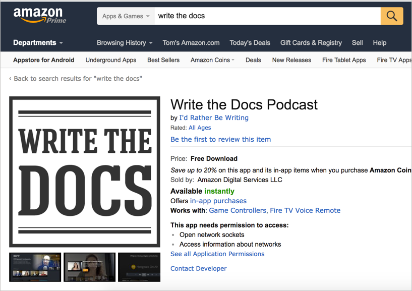
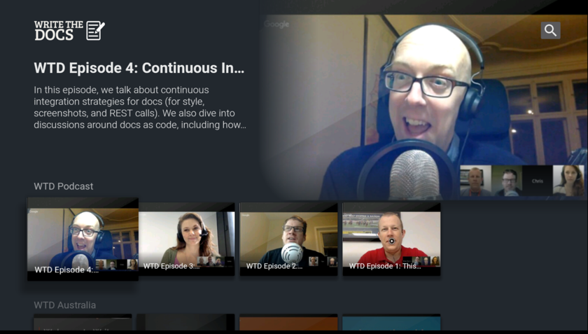
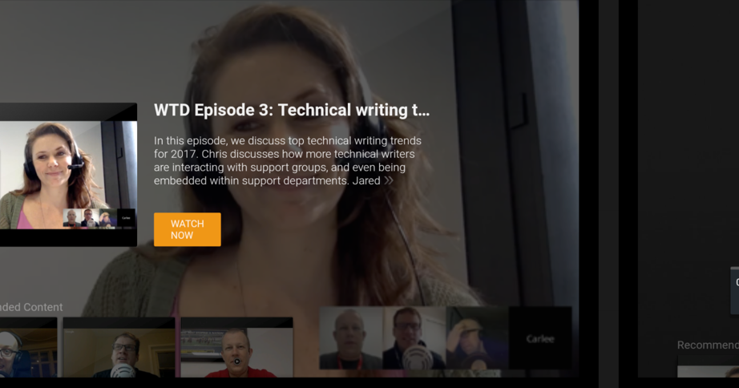

# Самостоятельное тестирование всех инструкций

После [настройки тестовой среды](https://github.com/Starkovden/Documenting_APIs/blob/master/5.%20Testing%20API%20documentaion/5.2.%20Set%20up%20a%20test%20environment.md#%D0%BD%D0%B0%D1%81%D1%82%D1%80%D0%BE%D0%B9%D0%BA%D0%B0-%D1%82%D0%B5%D1%81%D1%82%D0%BE%D0%B2%D0%BE%D0%B9-%D1%81%D1%80%D0%B5%D0%B4%D1%8B-%D0%BE%D0%BA%D1%80%D1%83%D0%B6%D0%B5%D0%BD%D0%B8%D1%8F) следующим шагом будет проверка инструкций. Потребуется тестирования конечных точек API с различными параметрами и конфигурациями. Тестирование всей документации может быть сложной задачей, но именно здесь получают наиболее полезную информацию в деле создания документации.

#### Содержание разделах

[Преимущества тестирования инструкций](#benefits)

[Через весь процесс](#through)

[Возможность проверки дополнительных функций](#empowered)

[Удовольствия тестирования](#pleasure)

[Учет необходимого времени](#time)

## Преимущества тестирования инструкций

Одним из преимуществ тестирования инструкций является то, что можно начать отвечать на свои вопросы. Вместо того чтобы поверить на слово инженеру, можно выполнить запрос, посмотреть ответ и сделать это самостоятельно. (предполагается, что приложение ведет себя правильно.)

Если обнаружится несоответствие с тем, что должно произойти, нужно указать инженеру на то, что не работает должным образом. Или можно внести предложения по улучшению рабочих процессов, терминов, ответов, сообщений об ошибках и т.д. Если просто делать заметки по тому, что говорят инженеры, или если просто копировать информацию из спецификаций или вики, то никакого тестирования не получится.

Когда что-то не работает, стоит фиксировать ошибки в таких системах отслеживания ошибок, как JIRA. Регистрация ошибок нужна для всей команды в целом и повышает ваш уровень среди разработчиков. Также очень интересно регистрировать ошибку в коде разработчика, потому что она показывает, что обнаружены недостатки и ошибки в том, что создали «боги кода».

Во время тестирования находятся ошибки и в документации. Например, протестировав запросы API, можно обнаружить неверный параметр. Вместо `verboseMode` параметр был просто `verbose`. Такое маленькое несоответствие - одна из тех деталей, которые не обнаружить без тестирования, не обнаружить, что работает, а затем решите выяснить, что не так.

Тестируя REST API, можно отправлять тестовые запросы с помощью [curl](https://github.com/Starkovden/Documenting_APIs/blob/master/2.%20Using%20an%20API%20like%20a%20developer/2.5.%20Make%20a%20curl%20call.md#%D1%81%D0%BE%D0%B7%D0%B4%D0%B0%D0%B5%D0%BC-curl-%D0%B2%D1%8B%D0%B7%D0%BE%D0%B2), [Postman](https://github.com/Starkovden/Documenting_APIs/blob/master/2.%20Using%20an%20API%20like%20a%20developer/2.3.%20Submit%20requests%20through%20Postman.md#%D0%BE%D1%82%D0%BF%D1%80%D0%B0%D0%B2%D0%BA%D0%B0-%D0%B7%D0%B0%D0%BF%D1%80%D0%BE%D1%81%D0%BE%D0%B2-%D0%B2-postman) или другого инструмента. Сохраняя запросы, можно быстро запускать различные сценарии.

Когда мы начинаем проводить тесты и эксперименты, мы начинаем узнавать, что работает, а что нет.

Например, в одной компании после настройки тестовой системы и выполнения некоторых запросов стало ясно, что часть документации не нужна. Вероятно, что полевым инженерам нужно будет самостоятельно настроить базу данных с определенным кодом, когда выяснилось, что ИТ-операции действительно будут выполнять эту настройку. Однако, разработчик сообщил, что полевые инженеры не смогут выполнить эту настройку, поэтому ее не должно быть в документации.

Такие мелочи, которые проясняются, когда весь процесс проходишь самостоятельно, увеличивают важность тестирования документации. Тестирование жизненно важно для написания хорошей документации для разработчиков. Никогда не следует доверять словам инженера о том, как что-то работает. Если последовать этому совету и протестировать всю документацию, можно добиться успеха в деле документирования API. Но если просто расшифровать то, что говорят разработчики, в итоге можно стать секретарем этих самых разработчиков. (Пост автора в блоге [Как не быть секретарем для инженеров](https://idratherbewriting.com/2018/11/19/avoid-being-secretary-for-engineers/).)

## Через весь процесс

Помимо тестирования отдельных конечных точек и других функций, также важно пройти весь пользовательский процесс от начала до конца.

Иногда обнаружить ошибки можно только после создания своего собственного приложения и отправки его в AppStore.

Например:  нужно сделать документацию шаблона приложения, предназначенного для сторонних разработчиков Android, создающих приложения потокового мультимедиа для Amazon Appstore. Чтобы лучше понять задачи и процессы разработчика, нужно понимать все шаги, которые пройдет разработчик. А это означает, что нужно создать приложение и отправить его в Appstore - пройти весь рабочий процесс от начала до конца. Чтобы создать пример приложения, сначала мне нужно выяснить, как получить контент для приложения.

Например, взять видеозаписи подкастов [Write the Docs](https://podcast.writethedocs.org/), и использовать их для приложения.
Поскольку шаблон приложения не поддерживает YouTube в качестве веб-хостинга, придется скачать MP4 с YouTube и загрузить их непосредственно на свой веб-хостинг. Затем нужно создать медиа-канал, который будет использоваться для интеграции с шаблоном приложения. Шаблон приложения может считывать все мультимедиа из канала, ориентируясь на него с помощью синтаксиса выражений Jayway Jsonpath или XPath.

Можно использовать Jekyll для подачи материала. (Материла автора курса на основе JSON можно посмотреть по адресу [podcast.writethedocs.org/fab.json](https://podcast.writethedocs.org/fab.json).) Самым сложным в настройке является настройка объекта рекомендаций. Каждое видео имеет несколько тегов. Объект рекомендаций должен показывать другие видео с таким же тегом. Получить JSON там сложно, но можно рассчитывать на поддержку форума Jekyll.

После того, как получены мультимедийный материал, интегрировать их в Fire App Builder было легко, потому что, в конце концов, для этого уже есть документацию.
Отправка приложения в AppStore является увлекательной частью рабочего процесса разработчика, которые могут быть не понятны тех.писателю. Просмотреть приложение подкаста Write the Docs на веб-сайте Amazon AppStore [здесь](https://www.amazon.com/Id-Rather-Be-Writing-Podcast/dp/B06Y23TNC4/ref=sr_1_1?s=mobile-apps&ie=UTF8&qid=1491708630&sr=1-1&keywords=write+the+docs).

Вот как выглядят экраны приложений на Fire TV:

Если выбрать видео, появится экран предварительного просмотра:

Казалось, что все прошло хорошо, но потом обнаружились некоторые ошибки, которые не обнаружить, без отправки приложения в AppStore. Во-первых, ориентация на устройства (перечисление определенных функций в манифесте Android для определения того, какие устройства Fire поддерживает приложение) не работает правильно для приложений Fire TV. (Эта проблема не была напрямую связана с шаблоном приложения.)

Обнаружились и другие проблемы. Несмотря на то, что разработчики тестировали шаблон приложения в течение многих месяцев, они не тестировали его загрузку в AppStore с помощью шаблона приложения. Оказывается, компонент внутриигровых покупок шаблона (не активный или не настроенный по умолчанию) автоматически активировал AppStore, чтобы добавить тег, указывающий, что приложение содержало внутриигровые покупки.

Этот тег покупки в приложении удивил команду разработчиков, и он вызвал бы много проблем, если бы все приложения, которые создавали сторонние разработчики, отображали этот тег.

Разработчики заявили, что пользователи могут просто отменить регистрацию компонента в приложении. Это нужно указывать в документации. Но проблема с тегом о внутриигровых покупок сохранялась и после попыток отменить регистрацию компонента в приложении и представлении новой версии.

Такой опыт подтверждает, насколько важно получить в руки код, который нужно задокументировать, и выполнить его от и до, насколько это возможно.

Не всегда бывает возможность выполнить код в реальных ситуациях, и бывают ситуации, когда приходится ограничить свою роль только редактированием и публикацией, но это не совсем желательный сценарий. Гораздо лучше брать в свои руки код, пытаться отработать сценарий, для которого все это было разработано. В самом деле, как еще можно написать хорошую документацию?

Команда разработчиков также утверждала, что это же приложение может быть отправлено в магазин приложений Google Play. Однако никто не проверял такое предположение. При отправке приложение в Google Play, Google отклонил его из-за отсутствия активов баннера, заявленных в манифесте, что вызвало предупреждения «опасного разрешения». Информацию получили разработчики, которые создали заявку в JIRA для решения проблем. Такое тестирование позволит не только создавать лучшую документацию, но и улучшить продукты, на которые создается документация. (И в свою очередь такое отношение улучшит доверие среди разработчиков)

Такой пример часто может повторяться и с другими проектами. Команда инженеров, также разработала шаблон приложения (веб вместо Android) для публикации приложений в AppStore. Этот инструмент был разработан для нетехнических конечных пользователей и должен был быть легким. Команда проекта даже не планировала никакой документации, за исключением краткого FAQ.

При тестировании инструмента от начала до конца, создании и отправки приложение, к концу работы, было более 30 вопросов, а также было обнаружено несколько важных проблем. Среди них были обнаружены ранее неизвестные ошибки, проблемы синхронизации.

## Возможность проверки дополнительных функций

Тестирование документации для разработчиков затруднительно, потому что мы часто просто предоставляем адресные API-интерфейсы для пользователей, чтобы интегрировать их в свои собственные приложения. Мы предполагаем, что разработчики уже имеют приложения, и поэтому все, что им нужно, это информация об интеграции API. Но во многих случаях вы не можете знать, какие проблемы возникают у API, пока не интегрируете его в пример приложения и не используете API в полном сценарии от начала до конца.

Например, для обычных пользователей Fire TV, которые не использовали шаблон приложения, также была написана документация о том, как интегрировать и отправлять рекомендации. Но, не имея собственного общего приложения Fire TV (не созданного с помощью Fire App Builder), чтобы проверить это, не получилось протестировать код для отправки рекомендаций. Пришлось принять на веру большую часть информации, основываясь на инструкциях разработчиков и отзывах, которые получали от пользователей бета-версии.

Как и следовало ожидать, позже были обнаружены пробелы в документации, которые нужно было устранить. Оказывается, при отправке рекомендации на домашний экран Fire TV, Fire TV использует только часть информации с рекомендациями, которая отправляется. Но оригинальных документах не было указано, какие поля на самом деле используются. Этот недостаток информации заставил разработчиков задуматься, правильно ли они интегрировали на рекомендации. Неудивительно, что на форумах сторонний разработчик вскоре спросил, что он делает не так, потому что поле, которое он передавал, казалось, игнорировалось на дисплее.

Создание приложения с нуля, которое использует все рекомендуемые вызовы API, требует больше усилий. Но чтобы написать лучшую документацию, нужно проделать большую работу, чтобы выявить все потенциальные проблемы, с которыми столкнутся пользователи. Если создание примера приложения выходит за рамки вашего уровня квалификации, стоит попросить разработчика о демонстрационном приложении или назначить встречу, на которой будет продемонстрирована нужная функцию.

В общем,  надо тестировать код, на который пишется документация, как можно глубже, насколько это возможно. При тестировании вы будете удивлены тем, что вы обнаружите. Сообщение команде о проблемах сделает продукт сильнее и повысит вашу ценность для команды.

## Удовольствия тестирования

Тестирование инструкций делает карьеру технического писателя гораздо более увлекательной. Даже так: тестирование всех документов - это то, что превращает техническое писательство из скучной, полуизолированной карьеры в увлекательную, интерактивную роль с вашей командой и пользователями.

Нет ничего хуже, чем стать секретарем для инженеров, где главная задача - записать, что говорят инженеры, создать заметки, отправить их им на рассмотрение, а затем выслушать каждое их слово, как будто они императоры, которые одобрят или забракуют ваш документ. Это не та работа технического писателя, которая может мотивировать.

Вместо этого, можно самому пройтись по инструкциям и подтвердить, работают ли они или нет, внося ясность или подробности по мере необходимости, тогда все становится интересным. (И на самом деле, чем больше узнаем о самой области знаний - технологиях, ландшафте продуктов, бизнесе, промышленности и т.д. - привлекательность профессии технического писателя резко возрастает.)

Напротив, если просто заниматься техническим редактированием, форматированием, публикацией и настройкой, такие действия, скорее всего, не особо полезны в технической карьере писателя. Работа технического писателя оживает только тогда, когда синапсы запускаются в область знаний, которая документируется, когда "пачкаются руки" при тестировании всех этапов и процессов.

## Учет необходимого времени

Стоит помнить, чтобы попробовать инструкции самостоятельно и с пользователями требуется время, что будет удваивать или даже утраивать время разработки документации. Написание подробных, точных инструкций, адресованных пользователям с различными настройками, компьютерами и целями, утомительно. Не всегда будет достаточно времени до релиза.

Но не стоит думать, что как только продукт будет выпущен, документация готова. Всегда можно вернуться к уже существующей, уже опубликованной документации и улучшить ее. Первый выпуск можно считать своего рода «версией 1» вашей документации. Это - первая итерация. Документация будет улучшаться с каждой итерацией. Если не получилось запустить тестовую систему до первого выпуска, это нормально. Можно создать тестовую систему для следующего выпуска.

В первой версии, можно фиксировать отзывы по мере использования документации (отзывы с форумов, контактные адреса электронной почты, журналы и другие средства), можно улучшить свою документацию и увидеть пробелы, которые были пропущены. В некотором смысле, каждый раз, когда пользователи обращаются к документации для выполнения задачи, они проверяют документацию. (Подробнее о получении отзывов см. [пост о восстановлении отсутствующего пользователя](https://idratherbewriting.com/simplifying-complexity/reconstructing-the-absent-user.html))

Помимо самостоятельного тестирования документации, ее также нужно тестировать и на пользователях.
