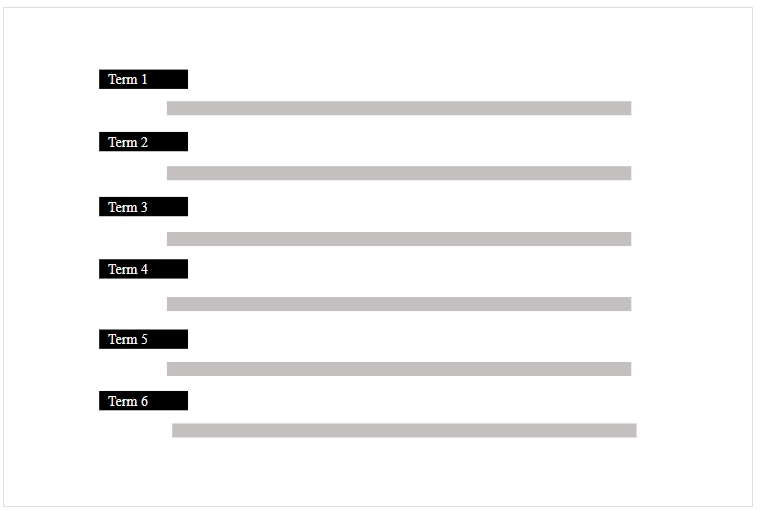

# API Глоссарий

В глоссарии API определяются все термины, которые могут быть уникальными для компании или API. Глоссарии часто пропускаются, но их важность не следует преуменьшать, поскольку большая часть понимания пользователем документации API зависит от ясности и согласованности конкретных терминов.

[Определяем любые слова](#define)

[Нужен ли глоссарий?](#provide)

[Требования к локализации и глоссариям](#requirements)

[Специализированные и неспециализированные термины](#terms)

[Интеграция глоссария с документацией](#integration)

[Образцы глоссария](#sample)

- [Lyft](#lyft)

- [Yext](#yext)

- [Apigee](#apigee)

[Практическое занятие: Глоссарий](#activity)

## Определяем любые слова

В отличие от большинства других профессиональных письменных дисциплин, техническая документация печально известна количеством специализированных терминов в своем содержании. Мало того, что у нас есть уникальные термины, относящиеся к нашим продуктам, так есть еще отраслевые жаргоны и термины, специфичные для компаний, вклинивающиеся в документацию, что и усложняет ее.

Евангелист API Kin Lane недавно отметил свое разочарование по поводу языка API, когда он обнаружил неопределенную аббревиатуру в некоторых документах API, которые он просматривал. Лейн объясняет:

> Я наткнулся на набор ресурсов API для управления DEG на днях. Вы можете добавлять, обновлять, удалять и получать DEG. Вы также можете использовать аналитику, историю и другие элементы DEG. Я потратил 10-15 минут на просмотр их портала для разработчиков, документации и даже поиска в Google, но так и не смог понять, что такое DEG. Нигде в своей документации они никогда не рассказывали потребителям, что такое DEG, вы просто должны были знать, я полагаю. Дизайнер API (если это произошло) и разработчик никогда не задумывались о том, что, возможно, кто-то наткнется на их общедоступный API и не знает, что такое DEG. ([Using Plain Language In Your API Paths](https://apievangelist.com/2018/07/09/use-plain-language-in-api-paths/))

В этом случае DEG должен быть аббревиатурой, специфичной для API разработчика. В таких случаях нет оправдания тому, что не определены собственные акронимы домашних животных и уникальный словарь.

Но во многих случаях аббревиатуры и незнакомые термины являются частью специализированной области. Техническому писателю необходимо использовать правильные термины в области знаний и  продукте, и те термины, которые часто соприкасаются с конкретной областью знаний.

Нельзя просто так взять и опустить необходимую терминологию и заменить более понятными именами. Нужно научить пользователей правильному языку, чтобы они могли участвовать в разговоре. Один общий подход к обучению пользователей тому, как говорить на этом языке, заключается в определении незнакомых слов для пользователя с помощью глоссария.

> Глоссарии не только дают пользователям ясность в отношении терминов, но и помогают авторам более четко и последовательно мыслить на эту тему.

[Здесь Глоссарий API](https://github.com/Starkovden/Documenting_APIs/blob/master/10.%20API%20glossary%20and%20Resourses/10.1.%20Glossary%20for%20API%20documentation.md) на этом курсе, в котором определены многие термины, относящиеся к документации API. Если встретится незнакомый жаргон, неопределенный в разделе, всегда можно обратиться к этому глоссарию.

## Нужен ли глоссарий?

## Требования к локализации и глоссариям

## Специализированные и неспециализированные термины

## Интеграция глоссария с документацией

## Образцы глоссария

### Lyft

### Yext

### Apigee

## Практическое занятие: Глоссарий
