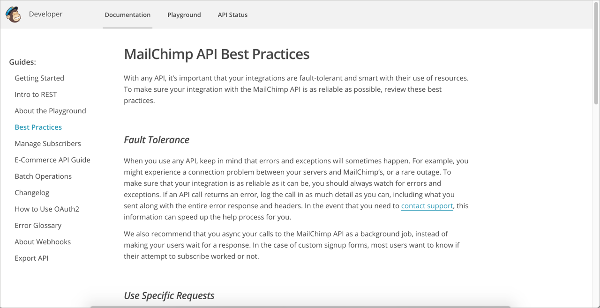
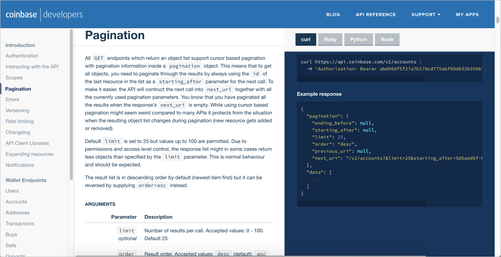

# Лучшие практики (Best practices) API

Лучшие практики API могут быть любыми советами, которые ваша команда разработчиков хочет сообщить разработчикам о работе с API. Нет определенного количества тем, которые обычно рассматриваются в передовых методах API. Вместо этого, лучшие практики могут быть общим заголовком для контента, который нигде не подходит.

[Какие темы включать в Best practices](#topics)

[Примеры Best practices](#samples)

- [Mailchimp](#mailchimp)

- [Coinbase](#coinbase)

[Практическое занятие: Best practices](#activity)

## Какие темы включать в Best practices

Хотя многие из тем в документации API являются стандартными, обычно есть подробный список вещей, которые нужно знать о работе с API. Такую информацию можно получить только по запросу разработчиков.

Список тем может включать такие темы, как:

- разбиение на страницы,
- временные диапазоны,
- отказоустойчивость,
- значения кэша,
- возможности подключения,
- тайм-ауты,
- время простоя,
- SSL,
- версии,
- тестирование и проверка,
- экспорты,
- языки,
- обработка номеров,
- расширение ресурсов,
- уведомления,
- CORS.,
- локализация

 и многое другое.

> Best practices охватывают ряд тем, обычно уникальных для вашего API

## Примеры Best practices

Ниже приведены примеры Best practices по использованию API с нескольких сайтов документации по API.

### Mailchimp

> Best practices Mailchimp

Best practices Mailchimp API включают советы по отказоустойчивости, использованию конкретных запросов, аутентификации, значениям кэша, подключению и регистрации. Благодаря отказоустойчивости Mailchimp напоминает разработчикам о том, что иногда случаются простои, поэтому они должны планировать соответствующую обработку сценариев, если API не отвечает. С помощью специальных запросов Mailchimp предупреждает пользователей о времени, которое может потребоваться, если запрос слишком общий, и, следовательно, возвращает слишком много информации.

### Coinbase

> Best practices Coimbase

Coinbase не ссылается на такие темы как лучшие практики; вместо этого навигационная панель показывает список тем. Пагинация - одна из этих тем, на которой стоит остановиться. Как нумерация страниц связана с API? Предположим, что конечная точка API возвращает все элементы в учетной записи пользователя. Может быть тысячи элементов, и если все элементы были возвращены в одном ответе, API может потребоваться много времени для сбора и возврата большого количества данных. В результате, как и при поиске в Google, ответ возвращает ограниченный набор, например первые десять элементов, а затем содержит URL-адрес, который можно использовать для перехода к следующему набору ответов. Разбиение на страницы относится к переходу на следующую страницу ответов.

Ранее, определяя характеристики REST,  упоминалась [HATEOS](https://github.com/Starkovden/Documenting_APIs/blob/master/1.%20Introduction%20to%20REST%20APIs/1.8.What%20is%20REST%20API.md#api-rest-%D0%BD%D0%B5-%D1%81%D0%BE%D1%85%D1%80%D0%B0%D0%BD%D1%8F%D1%8E%D1%82-%D1%81%D0%BE%D1%81%D1%82%D0%BE%D1%8F%D0%BD%D0%B8%D1%8F-%D0%B7%D0%B0%D0%BF%D1%80%D0%BE%D1%81%D0%B0-%D0%BD%D0%BE-%D0%BE%D1%82%D0%B2%D0%B5%D1%82%D1%8B-%D0%BC%D0%BE%D0%B3%D1%83%D1%82-%D0%BA%D1%8D%D1%88%D0%B8%D1%80%D0%BE%D0%B2%D0%B0%D1%82%D1%8C%D1%81%D1%8F) или «Гипермедиа как движок состояния приложения». Ссылки в ответах, которые возвращают больше результатов, являются одним из примеров HATEOS.

Программная обработка URL-адреса для получения большего количества ответов может быть довольно сложной задачей. Если нужно, чтобы все элементы были возвращены, а затем отфильтрованы и отсортированы, найдя конкретные значения для извлечения, как бы вы сделали это, используя URL-адрес, возвращенный в ответе? Команда может дать совет разработчикам, работающим с этими сценариями. Скорее всего, конечная точка будет предлагать фильтры в качестве параметров для применения к конечной точке, чтобы первоначальный ответ содержал требуемый набор элементов. Такой вид совета может быть уместен в лучших методиках API.

##   Практическое занятие: Best practices

В своем [найденном опен-сорс проекте](https://github.com/Starkovden/Documenting_APIs/blob/master/3.%20Documenting%20API%20endpoints/3.9.%20Activity%20Find%20an%20open%20source%20project.md#%D0%BF%D1%80%D0%B0%D0%BA%D1%82%D0%B8%D1%87%D0%B5%D1%81%D0%BA%D0%BE%D0%B5-%D0%B7%D0%B0%D0%BD%D1%8F%D1%82%D0%B8%D0%B5-%D0%BF%D0%BE%D0%B8%D1%81%D0%BA-open-source-%D0%BF%D1%80%D0%BE%D0%B5%D0%BA%D1%82%D0%B0) найдем раздел Best practices. Ответим на вопросы:

1. Существуют ли Best practices для работы с API, которые не вписываются ни в какие другие типичные темы API?
2. Как организованы Best practices в существующей документации? Они перечислены в FAQ?
3. Какие актуальные темы рассматриваются в Best practices?
4. Есть ли в проекте проблемы, которые должны быть отражены в Best practices API?
