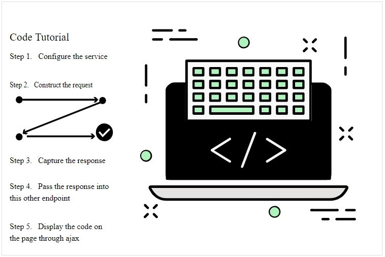
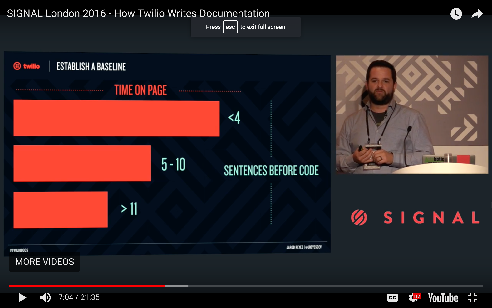

# Описание кода и образцы

У документации для разработчиков есть тенденция включать большое количество примеров кода. Примеры кода могут быть не включены в конечные точки, которые документируются. Но по мере того, как будут создаваться задачи и более сложные рабочие процессы, касающиеся того, как использовать API для достижения различных целей, будут использоваться разные конечные точки в которых будет указываться, как решать различные сценарии. Руководства по коду являются важной частью руководства пользователя.

#### Содержание раздела

[Образцы кода - конфета для разработчика](#candy)

[Дело не только в адресной документации](#refs)

[Фокус на "Почему?" а не "Что?"](#why)

[Добавляем комментарии к коду и пояснения "до и после"](#comments)

[Делаем примеры кода простыми](#simple)

[Делаем удобные примеры кода для "копипасты"](#copypaste)

[Предоставляем образец на целевом языке](#lang)

[Примеры описания кода](#samples)

- [Weather Underground](#weather)

- [Eventful](#eventful)

- [Twilio](#twilio)

- [Mailchimp](#mailchimp)

- [IBM Watson](#ibm)

[Пример кода для API прогноза погоды](#sampleCode)

[Практическое занятие: примеры кода](#activity)

## Образцы кода - конфета для разработчика

Образцы кода играют важную роль, помогая разработчикам использовать API. Код является другим языком, и когда пользователи, использующие этот язык, видят его, они получают гораздо больше, чем от простого текста (каким бы хорошим ни было описание).

> Код написан на другом языке, поэтому, как ни стараться описать общение на таком другом языке с помощью текста, все часто оказывается неэффективным. Разработчики понимают код гораздо лучше, чем текст.

В ходе пользовательского тестирования документации, проведенного Twilio, было обнаружено, что страницы, имеющие примеры кода, удобнее пользователям.

> В Twilio обнаружили, что когда у страниц было меньше предложений перед примерами кода, страницы привлекали пользователей больше.

В частности, страницы с менее чем 4 предложениями перед примерами кода выполняются дважды также, как и страницы с 11 предложениями перед примерами кода. Джарод Рейес объясняет:

> Дело больше в умственном блоке, чем в неспособности видеть код. Текст сообщает разработчику, что этой странице есть, что сказать, и что у него (разработчика) много работы. Разработчики не будут тратить время на чтение того, что вы хотите сказать. Мы видели это по всем разделам; мы видели это на всех страницах. Всякий раз, когда на странице много прозы и не так много кода, такая страница хорошо не работает. ([Как Twilio пишет документацию](https://eventil.com/talks/PPSznP-jarod-reyes-how-twilio-writes-documentation))

Другими словами, когда разработчики видят код, это равносильно просмотру темы, основанной на задачах, в руководстве пользователя - код указывает конкретное действие, которое должен предпринять разработчик, что привлекает внимание разработчиков.

## Дело не только в адресной документации

Иногда разработчики хотят избегать включения примеров кода в документы API, поскольку считают, что адресная документация по конечным точкам содержит всю информацию, необходимую разработчикам. Однако эта точка зрения часто недальновидна. В статье о программируемой сети под названием [Шесть столпов полной документации для разработчиков](https://www.programmableweb.com/news/six-pillars-complete-developer-documentation/2011/09/12) авторы объясняют:

> В то время как руководство разработчика должно помочь понять основные принципы использования API и его функциональных возможностей, оно не может охватить все возможные варианты использования этого API согласованным образом. Именно здесь появляются статьи и учебные пособия, чтобы научить разработчиков касательно или специализированному использованию API, например сочетать его с другим сервисом, фреймворком или API.

Другими словами, статьи и учебные пособия дополняют адресную документацию для предоставления полной инструкции. Примеры кода, которые показывают, как использовать различные конечные точки для достижения цели, занимают важное место в руководстве пользователя.

Кроме того, даже если включать примеры кода, уровень детализации и объяснения также может быть спорным. Многие разработчики предполагают, что аудитория имеет набор навыков, схожий с их собственным, без признания различных специализаций разработчиков. И поэтому они добавят пример кода, но не будут давать никаких объяснений по этому поводу. Внутренние разработчики часто говорят: «Если пользователь не понимает этот код, то и использовать наш API не стоит».

Если вы сталкиваетесь с таким отношением, напомните разработчикам, что пользователи часто имеют технические знания в разных областях. Например, пользователь может быть экспертом по Java, но только слегка знаком с JavaScript. Кто-то, кто является программистом базы данных, будет иметь другой набор навыков, чем тот, кто является программистом Python, у которого будет другой набор навыков и т.д. Учитывая эти различия и вероятную вероятность того, что у вас будет много начинающих (или незнакомых) пользователей, необходимы более обширные учебные руководства и пояснения.

## Фокус на "Почему?" а не "Что?"

Как только у вас появятся примеры кода в документации появится и вопрос: "как их документировать?" Пользовательские интерфейсы имеют четкие задачи - кнопки для нажатия, линейные рабочие процессы и т.д. Но документирование кода может быть более сложным. Стоит запомнить основной принцип: в любом примере кода надо сосредоточиться на вопросе «почему?», а не «что?». Нужно пояснить, почему вы делаете то, что делаете, а не подробно описывать то, что происходит, особенно когда вопрос "что?" относится к стандартной механике программирования, которая не уникальна для вашего API.

Например, вот разница:

- **ЧТО?**: "В этом коде несколько аргументов передаются в метод jQuery `ajax`. Ответ присваивается аргументу данных функции обратного вызова, что в данном случае является `success`";
- **ПОЧЕМУ?**: "Используйте метод `ajax` из jQuery, потому что он разрешает асинхронные ответы, которые не будут блокировать загрузку вашей страницы."

Разработчики, не знакомые с общим кодом, не связанным с вашей компанией (например, метод `.ajax()` из jQuery), должны обратиться к внешним источникам для получения руководств по этому коду. Не стоит писать свою собственную версию документации для другого языка программирования или сервиса. Вместо этого лучше сосредоточиться на частях кода, уникальных для своей компании. В остальном пусть разработчик полагается на другие источники (не стесняйтесь вставлять ссылки на другие сайты).

## Добавляем комментарии к коду и пояснения "до и после"

Документация кода должна сочетать комментарии кода с некоторыми пояснениями до или после примера кода. Разные языки имеют разные обозначения комментариев, но, как правило, краткие комментарии к коду выделяются косой чертой `//` в коде; более длинные комментарии выделяются между слешами и звездочками, например: `/ * .... * /`.

## Делаем примеры кода простыми

## Делаем удобные примеры кода для "копипасты"

## Предоставляем образец на целевом языке

## Примеры описания кода

### Weather Underground

### Eventful

### Twilio

### Mailchimp

### IBM Watson

## Пример кода для API прогноза погоды

## Практическое занятие: примеры кода
