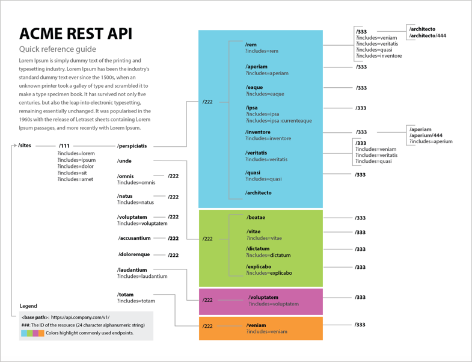
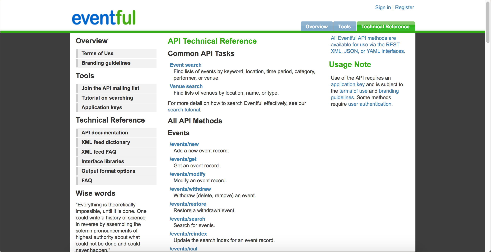
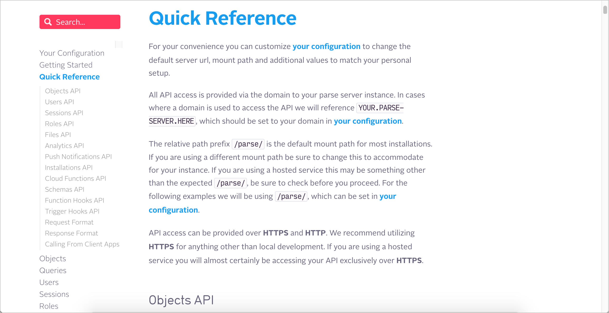
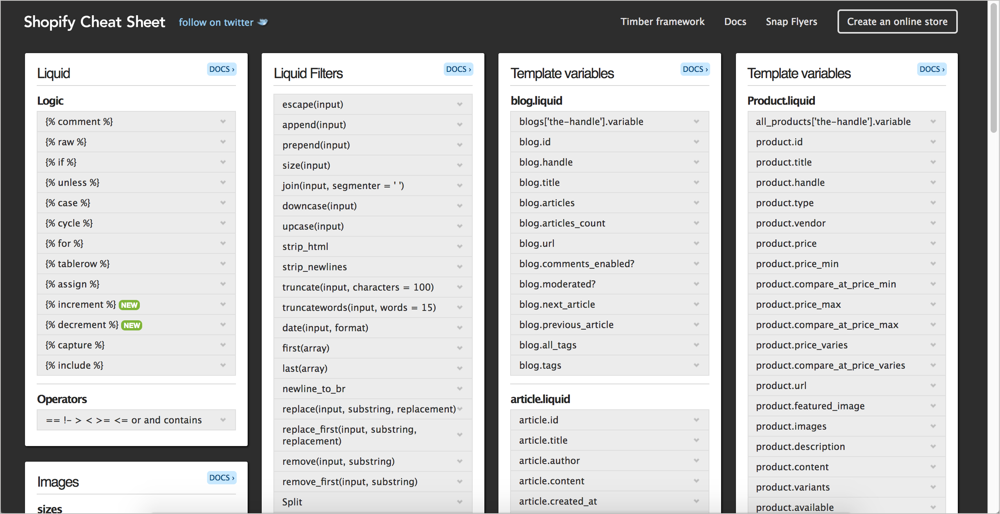

# Краткое справочное руководство

Краткое справочное руководство выполняет иную функцию, нежели руководства по началу работы. Хотя руководство по началу работы помогает новичкам ориентироваться, предоставляя сквозную инструкцию для выполнения простого запроса API, краткое справочное руководство помогает пользователям получить представление о системе в целом, часто путем предоставления списка конечных точек API.

#### Содержание раздела

[Необходимость в кратких справочных руководствах](#need)

[Преимущества чистой информации для изучения](#advantages)

[Примеры краткого руководства](#samples)

- [Eventful](#Eventful)

- [Parse](#Parse)

- [Shopify](#shopify)

[Практическое занятие: краткое справочное руководство](#activity)

## Необходимость в кратких справочных руководства

Будь то документация для конечного пользователя или документация для разработчика, в кратком справочном руководстве содержится 1-2-страничное руководство, где кратко описаны основные задачи и функции системы.

> Краткие справочные руководства содержат ключевую информацию, сжатую в краткий формат для удобства использования.

Краткое справочное руководство должно предоставить пользователю достаточно информации, чтобы понять суть системы, включая ключевые конечные точки и задачи. Часто конечные точки API имеют связь друг с другом, которые можно изобразить визуально. Вот пример диаграммы API, которую автор курса создал для одной из компаний:

> Формат краткого руководства

Текст в диаграмме приведен на латинице по соображениям конфиденциальности, поэтому логика может быть не совсем очевидной. Но в этом API конечные точки организованы в разные группы. Некоторые из групп имели несколько уровней в конечной точке, и несколько опций включения для каждой конечной точки. Диаграмма была создана в Adobe Illustrator и опубликована в формате PDF. Разработчики сочли такой формат полезным, потому что был охвачен API в целом, показав, как все конечные точки соединены друг с другом в логической гармонии. Для документации API обычное дело, что в кратком справочном руководстве перечислены сокращенные описания конечных точек. По этой причине вывод Swagger UI часто может служить кратким справочным руководством.

Вне документации API краткие справочные руководства, как правило, больше ориентированы на задачи. Для сервиса установки или настройки, может имеет смысл делать руководство более описательным, меньше используя визуальный формат. Вот пример макета для такого руководства:

> Такой формат краткого справочного руководства больше ориентирован на задачи, чем на конечные точки API.

В случае документации API, как правило, краткое справочное руководство фокусируется на визуальной группировке или отображении конечных точек, поскольку именно это составляет основную функциональность API.

## Преимущества чистой информации для изучения

Поскольку краткий справочник по сути представляет собой краткую сводку или описание всей системы, то информация собирается не только из одного источника. В результате, часто кажется, что у еще одного готового к работе технического писателя нет времени писать. Но для лучшего взаимодействия с пользователем не следует пропускать краткое справочное руководство, поскольку оно предоставляет неисчислимую ценность пользователям.

При создании краткого справочного руководства нужно стараться сжимать наиболее важную информацию в одну или две страницы, которые пользователи могут распечатать и закрепить на своей стене. Под "сжимать" не подразумевается сокращение шрифта до 6 пунктов, уменьшение начального значения и устранение всех пробелов. С помощью краткого справочного руководства нужно брать что-то надежное и сложное и минимизировать его до сути, но так, чтобы оно оставалось ясным для пользователей.

Благодаря такой "чистке" быстрые справочные руководства предоставляют пользователям уникальное преимущество в понимании материала. Предоставление общего обзора системы помогает пользователям получить представление целого, до углубления в детали.

> Подробное описание важности очищения информации для пользователей см. в статье [«Упрощение сложности»: сокращение, расслоение и перегонка как стратегия простоты](https://idratherbewriting.com/simplifying-complexity/reduction-layering-distillation.html). Чтение обзоров, сводок и другой высокоуровневой информации для быстрого обзора может помочь пользователям понять сложную систему различными способами. Слишком часто пользователи сталкиваются с техническими деталями без какой-либо подготовки и ориентации в целом.

Распределение больших объемов информации в кратко сформулированные заголовки, резюме, заголовки, мини-оглавления и тематические предложения может облегчить потребление и понимание информации. Краткие справочные руководства поднимают принцип очищения на другой уровень, сжимая всю систему в минимальный объем информации.

Краткие справочные руководства похожи на [поэзию технического письма](https://idratherbewriting.com/2008/07/06/quick-reference-guides-the-poetry-of-technical-writing/). Цель не просто быть кратким или консистентным. С поэзией поэт пытается вызвать настроение или нарисовать момент, и в этот короткий момент захватить сущность целого. Написание краткого справочного руководства требует практически таких же усилий. Дело не в простом сокращении слов, чтобы сделать документацию короче, или ограничении вывода несколькими темами, а в попытках сжать документацию в целом и выразить ее минималистский эквивалент.

Задача, вероятно, невозможна для технического материала. Тем не менее, попытка того стоит, и философия остается прежней. Краткие справочные руководства научат нас пользоваться системой за 5 минут, а не за 5 часов. Это философия упрощения и языковой эффективности.

Не стоит обманываться краткостью и масштабом краткого справочного руководства. При разработке такого руководства можно потратить несколько дней на написание только одной страницы. Но когда финал может быть отлит золотом!

## Примеры краткого руководства

Ниже приведены примеры кратких справочных руководств на различных сайтах документации по API.

### Eventful

> краткое руководство Eventful

Eventful предоставляет быстрый список всех конечных точек в API на одной странице, упорядоченный по группам ресурсов. Каждая конечная точка описана примерно в половину строки, поэтому можно быстро понять их все. Например, описание для `/events/get` в их кратком справочнике: «Получить запись о событии». Но если щелкнуть для получения более подробной информации, более подробное определение будет «При наличии идентификатора события возвращает данные о событии, связанные с этим событием». , См. [http://eventful.com/events/E0-001-000278174-6](http://cincinnati.eventful.com/events/martini-tasting-/E0-001-000278174-6) для примера интерфейса».

С первого взгляда на конечные точки можно получить определенное понимание. Взглянув с высоты на лес, можно увидеть форму леса в целом. Можно не знать, какие деревья содержит лес, но можно понять другие детали, которые не видны, когда видишь одно дерево.

### Parse

> краткое руководство Parse

Краткий справочник Parse похож на Eventful в том, что это длинный список конечных точек, на этот раз сгруппированный в таблицы. Эта справочная страница является просто разделом в одной длинной single page странице документации. При их подходе вся документация находится на одной странице, но при прокрутке вниз выделяются разные записи на боковой панели.

Иногда разработчикам нравится одностраничный подход, потому что он уменьшает фрагментацию информации и позволяет им использовать Ctrl + F, чтобы найти все экземпляры ключевого слова. Исследования компромиссов такого одностраничного подхода описаны в [Single-page docs versus "Click Insanity"](https://idratherbewriting.com/2014/01/12/single-page-docs-versus-click-insanity/).

При использовании [справочной документации OpenAPI на GitHub](https://github.com/OAI/OpenAPI-Specification/blob/master/versions/3.0.2.md), заметно, что документация также содержится на одной странице. Разработчики могут использовать `Ctrl + F`, для быстрого поиска. Тем не менее такая документация обеспечивает много визуальной сложности для понимания пользователям.

### Shopify

> краткое руководство Shopify

Краткое руководство Shopify не про API, но оно показывает фильтры, переменные и другие функции, доступные в Liquid, который является языком сценариев для разработчиков. Здесь Shopify использует функциональность свертывания и расширения для сжатия информации.

Такое краткое справочное руководство удобно тем, что позволяет одновременно просматривать все доступные функции в Liquid, чтобы знать, что нужно для получения дополнительной информации. Это как карта местности Liquid. Карта позволяет узнать все существующие функции.

## 👨‍💻 Практическое занятие: краткое справочное руководство

В своем [найденном опен-сорс проекте](https://github.com/Starkovden/Documenting_APIs/blob/master/3.%20Documenting%20API%20endpoints/3.9.%20Activity%20Find%20an%20open%20source%20project.md#%D0%BF%D1%80%D0%B0%D0%BA%D1%82%D0%B8%D1%87%D0%B5%D1%81%D0%BA%D0%BE%D0%B5-%D0%B7%D0%B0%D0%BD%D1%8F%D1%82%D0%B8%D0%B5-%D0%BF%D0%BE%D0%B8%D1%81%D0%BA-open-source-%D0%BF%D1%80%D0%BE%D0%B5%D0%BA%D1%82%D0%B0) найдем краткое справочное руководство. Ответим на следующие вопросы:

1. Существует ли краткое справочное руководство по API? Возможно, список конечных точек API?
2. Есть ли вывод Swagger UI, который служит кратким справочником по API?
3. Если нет краткого справочного руководства, выиграет ли API от этого? Почему да или почему нет?
4. Помимо списка сокращенных описаний конечных точек, что еще можно добавить в краткое справочное руководство API? Общие задачи?
5. Есть ли несколько важных задач, которые пользователи должны выполнять с помощью API? Обсуждаются ли эти основные задачи в руководстве по началу работы?
