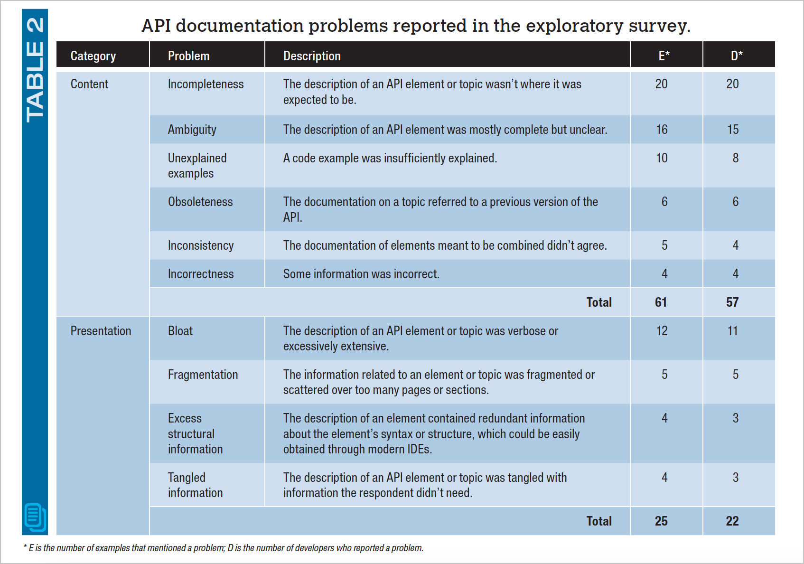
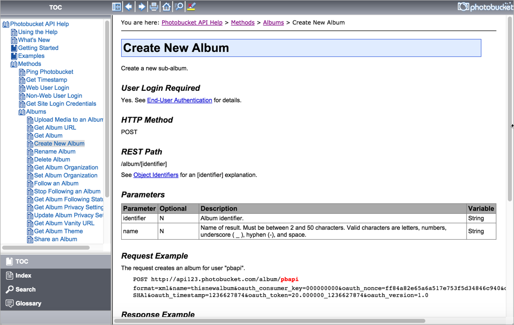

# Обзор вариантов публикации документации

Когда технический писатель ищет способы принести пользу в высокотехнологичной организации, он может обнаружить, что написания технического контента занимает меньшее время, чем его редакция/публикация. Можно вести и управлять публикацией технического контента, который в основном разрабатывают инженеры. По этой причине публикации отведен полноценный модуль на этом курсе о документировании API.

[Зачем фокусироваться на публикации?](#focus)

[Инструменты совместной работы](#colaborate)

- [1. Инструменты HAT (Help Authoring Tool) не соответствуют рабочим процессам и средам разработчиков](#dismatch)
- [2. HAT не будут генерировать документы из источника](#notSource)
- [3. Документ API соответствует определенной структуре и шаблону, не смоделированному ни в одном HAT](#nonmodel)
- [4. Многие API имеют интерактивные консоли, позволяющие осуществлять запросы](#consoles)
- [5. В API документ *является* интерфейсом продукта, поэтому он должен быть достаточно привлекательным для продажи продукта.](#product)

[Новое направление: генераторы статичных сайтов](#generators)

[Видео об инструментах публикации API документации](#video)

## Зачем фокусироваться на публикации?

Первый вопрос, касающийся публикации документации по API, может быть такой: *почему?* Что делает публикацию API-документации настолько отличной от публикации других видов документации, что она заслуживает отдельного модуля? Как и почему подход с публикацией документов API должен отличаться от подхода публикации обычной документации?

Работая с документацией API мы не находимся в области документации с графическим интерфейсом пользователя (GUI), обычно предназначенной для основных конечных пользователей. Большая часть контента для разработчиков сложна и требует опыта не только в программировании, но и в конкретном языке программирования или среде.

Так, технический писатель, может обнаружить, что все слишком сложно и будет полагаться на разработчиков, которые пишут больше контента. Закачивается все тем, что техписатель играет роль инструмента документооборота и рабочего процесса.

В статье [Как проваливается документация API](https://ieeexplore.ieee.org/document/7140676) (опубликовано в [IEEE Software](https://ieeexplore.ieee.org/Xplore/home.jsp)), Мартин Робиллард и Гиас Уддин опросили разработчиков, чтобы выяснить, в чем провал API документации для них. Было обнаружено, что большинство недостатков были связаны с содержанием: неполное, неточное, отсутствует, неоднозначное, фрагментированное и т. Д. Они суммировали свои выводы здесь:

> Причины провала документации

Проблема в том, что те самые люди, которые могут исправить этот контент, обычно полностью заняты разработкой. Робиллард и Уддин пишут:

> Возможно неудивительно, что самые большие проблемы с документацией API были теми, где требуется технический опыт для решения. Заполнение, уточнение и исправление документации требуют глубоких, авторитетных знаний о реализации API. Это затрудняет выполнение этих задач для тех, кто не является разработчиком или недавно в проекте.
Итак, как мы можем улучшить документацию по API, если люди, которые могут выполнить такую задачу, слишком заняты, чтобы выполнять ее, или работают над задачами, которым был присвоен более высокий приоритет? Одним из возможных путей продвижения является разработка систем рекомендаций, которые могут уменьшить как можно больше административных накладных расходов при написании документации, позволяя экспертам сосредоточиться исключительно на производительной части задачи. Как обнаружили Бартелеми Дагенаис и Мартин Робиллард, основной проблемой для развития документации API является определение того, где документ должен быть обновлен.

Например, предположим, выявлена высокую точку трения разработчиков, связанная с плохой документацией. Исправление может быть не только в вопросе преобразования контента на простой язык или добавления некоторых деталей о пропущенных параметрах. Требуемые исправления могут включать объяснение того, как параметры взаимодействуют в коде, как одно значение используется другим, как они отображаются в переменных, через которые проходит код, и т. Д. Возможно, единственный человек, который действительно поймет сумасшедший синтаксис пользователей, и опишет его - это ведущий разработчик.

Но угадайте! Какой ведущий разработчик успеет изучить документы? Такой человек обычно глубоко погружен в сложный сценарий программирования. Поэтому тот человек, который обладает знаниями, необходимыми для декомпиляции и вычленения необходимых понятий из документации, обычно не может это сделать. Но если содержание выходит за рамки понимания универсалов, в какой-то момент, писатели должны будут посвятить некоторое время документации. В этих сценариях, говорят Робиллард и Уддин, лучшая помощь будет заключаться в сокращении издержек процесса документирования.

Как редактор/издатель, вы можете помочь такому автору, точно указав причину путаницы, область документа, которая нуждается в обновлении, и предоставив ему простые инструменты для обновления. Разработчики не должны быть обеспокоены поиском статических генераторов сайтов или публикаций рабочих процессов, PDF-файлов или других инструментов публикации документов. Роль редактора/издателя, может внести ценный вклад в работу команды разработчиков продукта. Именно эта роль в качестве специалиста по инструментам документирования особенно актуальна в контексте документации API.

## Инструменты совместной работы

При сотрудничестве разработчиков и писателей стоит рассмотреть возможность использования инструментов, ориентированных на разработку, а не инструментов, ориентированных на написание. Когда автор курса впервые перешел на документацию API, то решил использовать DITA и преобразовал в нее большую часть своего контента.

При изучении других сайтов документации API, в первую очередь тех, которые перечислены на [Programmableweb.com](https://www.programmableweb.com/apis/directory), где хранится самый большой каталог веб-API, он нашел мало сайтов документации API на основе DITA. Оказывается, что почти ни один из сайтов документации API, перечисленных в Programmable Web, даже не использует традиционные инструменты для создания технических коммуникаций.

Несмотря на множество достижений, связанных с единым источником, повторным использованием контента, условной фильтрацией и другими функциями в инструментах разработки справки и системах управления контентом, их практически не используют сайты документации API (по крайней мере, те, которые перечислены на Programmableweb.com). Почему? Почему сообщество разработчиков неявно отвергло инструменты технической коммуникации и их многолетнюю эволюцию?

Конечно, есть случайные HAT (Help Authoring Tool), как и в API Photobucket, но они редки. И еще реже можно найти сайт API, который структурирует контент в DITA.

Быстрый ответ заключается в том, что документацию API пишут все больше инженеров. Содержание настолько техническое, что они единственные, кто понимает это. И когда инженеры пишут, они естественно стремятся к инструментам и рабочим процессам, с которыми они знакомы.

[Эндрю Дэвис](http://www.synergistech.com/contact_us.html), специалист по подбору технических писателей, разбирающихся в документировании API в Bay AREA, считает, что специализироваться на инструментах docs-as-code на 100% выгоднее, чем стать адептом DITA или других инструментов, ориентированных на технических специалистов.

Дэвис знает рынок, особенно рынок Силиконовой долины, очень хорошо. он призывает следовать за идеей генераторов статических сайтов (вместо DITA). Он считает, что многие небольшие компании, особенно стартапы, ищут авторов, способных публиковать документацию, которая выглядит красиво, как многие современные веб-выходы на Programmableweb.

Его ответ и последующий акцент автора курса на генераторах статических сайтов привели к пониманию того, почему традиционные инструменты создания справки не часто используются в пространстве документации API. Остановимся на пяти основных причинах, по которым технические писатели используют инструменты docs-as-code в пространствах документации для разработчиков:

### 1. Инструменты HAT (Help Authoring Tool) не соответствуют рабочим процессам и средам разработчиков

Если разработчики собираются внести свой вклад в документацию (или написать документ полностью самостоятельно), инструменты должны соответствовать их собственным рабочим процессам. Их инструментарий состоит в том, чтобы рассматривать документ как код, связывать его с контролем версий, создавать выходные данные с сервера и т. Д. Они хотят упаковать документацию вместе с другим кодом, проверить ее в своих репозиториях и автоматизировать как часть процесса сборки. Если разработчики вносят свой вклад в документацию, тем писателям, которые используют HAT будет сложно.

В добавок, практически нет такого HAT. который работает на Mac. Многие разработчики и дизайнеры предпочитают Mac, потому что у них гораздо лучшая платформа разработки (например, командная строка намного удобнее и функциональнее). Для любителей Windows, могут быть сложности при установке инструментов разработчика или следовании справочникам по настройке и тестировании контент.

А если заставить разработчиков использовать HAT, нужно покупать лицензию для каждого участвующего разработчика. Напротив, инструменты «docs-as-code» часто имеют открытый исходный код и поэтому могут масштабироваться по всей компании без бюджетного финансирования и утверждения.

### 2. HAT не будут генерировать документы из источника

В идеале разработчики захотят добавить аннотации в свой код, а затем генерировать документ из этих аннотаций. Они делали это с помощью кода Java и C ++ в [Javadoc](https://github.com/Starkovden/Documenting_APIs/blob/master/9.%20Native%20library%20APIs/9.4.%20Activity%20Generate%20a%20Javadoc%20from%20a%20sample%20project.md) и [Doxygen](https://github.com/Starkovden/Documenting_APIs/blob/master/9.%20Native%20library%20APIs/9.8.%20Doxygen%2C%20a%20document%20generator%20mainly%20for%20C%2B%2B.md) в течение последних 25 лет (полный список этих инструментов см. [Comparison of document generators](https://en.wikipedia.org/wiki/Comparison_of_documentation_generators) в Википедии).

Даже для API REST существуют инструменты и библиотеки, которые автоматически генерируют документацию из аннотаций исходного кода (например, из Java в спецификацию OpenAPI через [Swagger Codegen](https://swagger.io/tools/swagger-codegen/)), но это не то, что могут сделать HAT. Для получения дополнительной информации об автоматической генерации из источника см. [Автоматическая генерация файла OpenAPI из аннотаций кода](https://github.com/Starkovden/Documenting_APIs/blob/master/4.%20OpenAPI%20specification%20and%20Swagger/4.2.%20Introduction%20to%20the%20OpenAPI%20spec%20and%20Swagger.md#%D0%B0%D0%B2%D1%82%D0%BE%D0%BC%D0%B0%D1%82%D0%B8%D1%87%D0%B5%D1%81%D0%BA%D0%B0%D1%8F-%D0%B3%D0%B5%D0%BD%D0%B5%D1%80%D0%B0%D1%86%D0%B8%D1%8F-%D1%84%D0%B0%D0%B9%D0%BB%D0%B0-openapi-%D0%B8%D0%B7-%D0%B0%D0%BD%D0%BD%D0%BE%D1%82%D0%B0%D1%86%D0%B8%D0%B9-%D0%BA%D0%BE%D0%B4%D0%B0).

### 3. Документ API соответствует определенной структуре и шаблону, не смоделированному ни в одном HAT

Разработчики часто хотят поместить адресную документацию для API в четко определенные шаблоны, которые содержат такие разделы, как параметры конечных точек, примеры запросов, примеры ответов и т. Д. (Список разделов изучали в модуле [Документировании конечных точек API](https://github.com/Starkovden/Documenting_APIs/tree/master/3.%20Documenting%20API%20endpoints#%D0%B4%D0%BE%D0%BA%D1%83%D0%BC%D0%B5%D0%BD%D1%82%D0%B8%D1%80%D0%BE%D0%B2%D0%B0%D0%BD%D0%B8%D0%B5-%D0%BA%D0%BE%D0%BD%D0%B5%D1%87%D0%BD%D1%8B%D1%85-%D1%82%D0%BE%D1%87%D0%B5%D0%BA))

При наличии большого количества конечных точек, нужна система для загрузки контента в стандартные шаблоны. В идеале надо разделять различные разделы (описание, параметры, ответы и т. Д.), А затем компилировать информацию через шаблон при создании сайта. Или можно использовать спецификацию, такую ​​как [OpenAPI](https://github.com/Starkovden/Documenting_APIs/blob/master/4.%20OpenAPI%20specification%20and%20Swagger/4.2.%20Introduction%20to%20the%20OpenAPI%20spec%20and%20Swagger.md#%D0%B7%D0%BD%D0%B0%D0%BA%D0%BE%D0%BC%D1%81%D1%82%D0%B2%D0%BE-%D1%81%D0%BE-%D1%81%D0%BF%D0%B5%D1%86%D0%B8%D1%84%D0%B8%D0%BA%D0%B0%D1%86%D0%B8%D1%8F%D0%BC%D0%B8-openapi-%D0%B8-swagger), чтобы добавить информацию в шаблон. Можно включать также пользовательские сценарии. Тем не менее, такие опции часто отсутствуют в HAT, из-за ограничений наличия рабочих процессов и шаблонов, поддерживаемых «из коробки».

### 4. Многие API имеют интерактивные консоли, позволяющие осуществлять запросы

В HAT отсутствует [интерактивная консоль API](). Под интерактивной консолью API имеется ввиду, что вы вводите свой собственный ключ и значения API, а затем запускаете вызов непосредственно с веб-страниц в документации. ([Flickr API Explorer](https://www.flickr.com/services/api/explore/?method=flickr.photos.search) предоставляет такой пример интерактивности, так же, как и [Swagger UI](https://github.com/Starkovden/Documenting_APIs/blob/master/4.%20OpenAPI%20specification%20and%20Swagger/4.14.%20Swagger%20UI%20tutorial.md#%D1%80%D1%83%D0%BA%D0%BE%D0%B2%D0%BE%D0%B4%D1%81%D1%82%D0%B2%D0%BE-swagger-ui)) Ответ, получаемый от этих инструментов, основан на наших собственных данных в API.

### 5. В API документ *является* интерфейсом продукта, поэтому он должен быть достаточно привлекательным для продажи продукта

Большинство выходных данных HAT выглядят устаревшими и старыми. Они выглядят как пережиток эпохи Интернета до 2000 года. (Подробнее см. [Справку Tripane и файлы PDF: мимо их расцвета?](http://www.robertdesprez.com/2013/01/18/tripane-help-and-pdfs-time-to-move-on/) От Роберта Деспреза.)

Например, вот пример вывода справки из Flare для API Photobucket:

В документации API часто документация является интерфейсом продукта - нет отдельного GUI продукта (графический пользовательский интерфейс), с которым взаимодействуют клиенты. Поскольку графический интерфейс продукта - это документация, он должен быть привлекательным и сексуальным.

Большинство справок Tripane не выглядит так. Если справка выглядит старой и основанной на фреймах, она не внушает особого доверия разработчикам в ее оценке.

В последнем выпуске Flare довольно много настроек отображения, возможно, это поможет закончить внешний вид устаревшего вывода Tripane. Тем не менее, усилия и процесс создания выходных данных для HAT обычно кардинально отличаются от настройки выходных данных генератора статических сайтов. Веб-разработчикам будет гораздо удобнее с последним.

## Новое направление: генераторы статичных сайтов

Основываясь на всех этих факторах, Том Джонсон решил приостановить работать в DITA и попробовать новый инструмент для документации: [Jekyll](https://github.com/Starkovden/Documenting_APIs/blob/master/7.%20Publishing%20your%20API%20documentation/7.14.%20Jekyll%20and%20CloudCannon%20continous%20deployment%20tutorial.md#%D0%BD%D0%B5%D0%BF%D1%80%D0%B5%D1%80%D1%8B%D0%B2%D0%BD%D0%BE%D0%B5-%D1%80%D0%B0%D0%B7%D0%B2%D0%B5%D1%80%D1%82%D1%8B%D0%B2%D0%B0%D0%BD%D0%B8%D0%B5-jekyll-%D0%B8-cloudcannon). Jekyll позволяет работать с Markdown, использовать Liquid для условной логики и инициировать сборки непосредственно из репозитория.

Понятно, что не у всех есть возможность выбирать средства разработки, но когда Том Джонсон сделал это, его компания была стартапом, и было всего три писателя с минимальным количеством устаревшего контента. Том не был обременен кучей долгов документации или обременительными процессами, поэтому я мог вводить новшества.

Jekyll - это всего лишь один из вариантов публикации документации в пространстве документации API. Хорошо работать с подходом Jekyll, [основанным на коде](https://github.com/Starkovden/Documenting_APIs/blob/master/7.%20Publishing%20your%20API%20documentation/7.4.%20Doc_as_code%20tools.md#%D0%B8%D0%BD%D1%81%D1%82%D1%80%D1%83%D0%BC%D0%B5%D0%BD%D1%82%D1%8B-%D0%BF%D0%BE%D0%B4%D1%85%D0%BE%D0%B4%D0%B0-docs-as-code), но есть [много разных инструментов](https://github.com/Starkovden/Documenting_APIs/blob/master/7.%20Publishing%20your%20API%20documentation/7.10.%20Static%20site%20generators.md) и [опций публикации](https://github.com/Starkovden/Documenting_APIs/blob/master/7.%20Publishing%20your%20API%20documentation/7.11.%20Hosting%20and%20deployment%20options.md). Все это мы изучим в этом модуле.

Теперь, когда установлено, что традиционные HAT не являются инструментами перехода к документации API, рассмотрим различные способы публикации документации API. Большинство из этих путей уведут нас от традиционных инструментов технической коммуникации к инструментам, ориентированным на разработчиков.

## Видео об инструментах публикации API документации

Можно просмотреть [презентацию по данной теме](https://youtu.be/__vSXJn-JQo), которую автор сделал на встрече WriteTheDocs в South Bay
