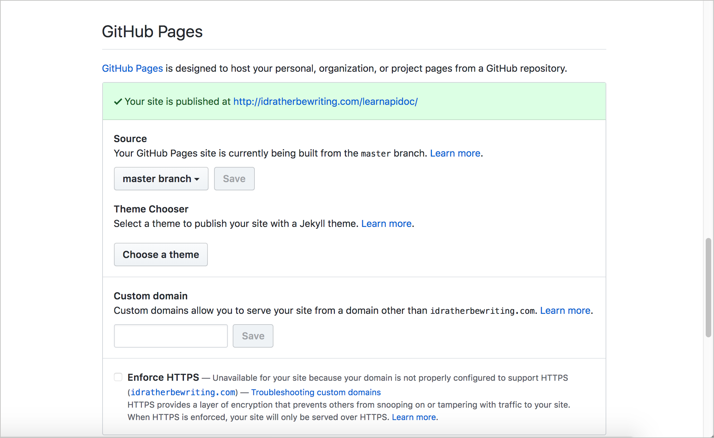

# Варианты хостинга и развертывания

[Генераторы статичных сайтов](https://github.com/Starkovden/Documenting_APIs/blob/master/7.%20Publishing%20your%20API%20documentation/7.10.%20Static%20site%20generators.md#%D0%B3%D0%B5%D0%BD%D0%B5%D1%80%D0%B0%D1%82%D0%BE%D1%80%D1%8B-%D1%81%D1%82%D0%B0%D1%82%D0%B8%D1%87%D0%BD%D1%8B%D1%85-%D1%81%D0%B0%D0%B9%D1%82%D0%BE%D0%B2) занимаются разработкой контента, но не поддержкой и развертыванием. Для этого нам понадобится другая категория инструментов. Назовем эту категорию инструментов «опциями хостинга и развертывания».

Теоретически, можно опубликовать статичный веб-сайт на любом веб-сервере (например, AWS S3, Bluehost и т.д.). Но платформы хостинга с непрерывной доставкой делают нечто большее: они автоматически формируют результат при внесении изменений в репозиторий. Весь процесс сборки происходит полностью на сервере.

Платформы хостинга и развертывания обычно предлагают ряд дополнительных функций помимо простого веб-хостинга, например:
- SSL,
- CDN,
- минимизация,
- аутентификация,
- резервное копирование / резервирование
- и многое другое.

Эти платформы часто также интегрируются с определенными генераторами статичных сайтов (что является одной из причин, по которой ограничены предыдущие рассуждения о Jekyll, Hugo и Sphinx).

[GitHub Pages](#githubPages)

[CloudCannon](#cloudCannon)

[Read the Docs](#readthedocs)

[Netlify](#netlify)

[Aerobatic](#aerobatic)

## GitHub Pages

[GitHub Pages](https://pages.github.com/) предоставляет бесплатный вариант размещения и развертывания для проектов Jekyll. Загружая проект Jekyll в репозиторий GitHub, можно указать в настройках репозитория GitHub, что это проект Jekyll, и GitHub автоматически создаст его при фиксации репозитория. Эта функция - создание проектов Jekyll непосредственно из репозитория GitHub - называется GitHub Pages.

Чтобы активировать GitHub Pages для своего проекта нужно перейти на вкладку **Settings** и прокрутить страницу вниз до **GitHub Pages**

## CloudCannon

## Read the Docs

## Netlify

## Aerobatic
