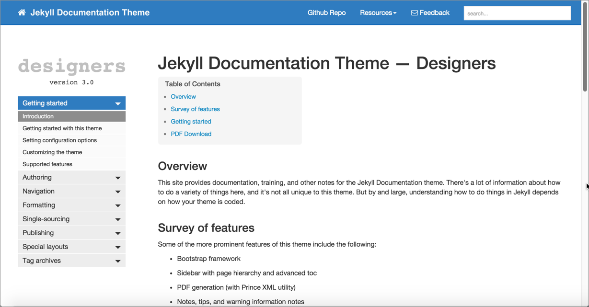

# Непрерывное развертывании Jekyll и CloudCannon

[Генераторы статических сайтов](https://github.com/Starkovden/Documenting_APIs/blob/master/7.%20Publishing%20your%20API%20documentation/7.10.%20Static%20site%20generators.md) - это разновидность компиляторов веб-сайтов, которые упаковывают группу файлов (обычно написанных на [Markdown](https://github.com/Starkovden/Documenting_APIs/blob/master/7.%20Publishing%20your%20API%20documentation/7.5.%20More%20about%20Markdown.md)) и превращают их в полностью развертываемый веб-сайт. Одним из наиболее популярных генераторов статических сайтов (глядя на количество загрузок, использования и сообщества) является [Jekyll](https://jekyllrb.com/). Автор курса выбрал его, т.к. имеет большой опыт, поэтому сосредоточимся здесь на Jekyll, особенно на том, как можно интегрировать Jekyll с CloudCannon для решения публикации с непрерывной доставкой.

[О Jekyll](#about)

[Разработка контента в Jekyll](#develop)

[Автоматизация сборок из GitHub](#build)

[Настройка темы документации на GitHub](#setup)

[Обновление репозитория GitHub](#update)

[Тема Jekyll Aviator](#aviator)

## О Jekyll

Jekyll - это [генератор статических сайтов]() на основе Ruby, то есть он использует Ruby в качестве основного языка программирования для компиляции сайта. Cайт с оригиналом курса и [блог автора](https://idratherbewriting.com/) используют Jekyll. [Здесь](https://developer.amazon.com/appstore/documentation) документация также использует Jekyll. С Jekyll можyj опубликовать полнофункциональный веб-сайт технической поддержки, который включает повторное использование контента, условную фильтрацию, переменные, вывод PDF и все то, что может понадобиться техническому писателю.

Вот [тема документации](https://idratherbewriting.com/documentation-theme-jekyll/), которую Том Джонсон разработал для Jekyll:

Здесь нет никакого специального форматирования конечной точки API, но платформа настолько гибкая, что можyj делать с ней все, что угодно, если знать HTML, CSS и JavaScript (основной язык Интернета). Благодаря генератору статического сайта у нас есть инструмент создания полноценного веб-сайта с использованием практически любого стиля или JavaScript-фреймворка. На веб-сайте Jekyll можно включить сложную навигацию, повторное использование контента, переменные и многое другое.

Генераторы статических сайтов дают большую гибкость. Такие сайты являются хорошим выбором, если нужен обширный контроль и гибкие настройки сайта. В них отсутствует привязка к жестким шаблонам и стилям. Свои собственные шаблоны и вещи можно определять и структурировать по желанию. Например, со статическими генераторами сайтов можно сделать следующее:

- писать в текстовом редакторе, работающем с Markdown;
- создавать кастомные шаблоны документации;
- использовать рабочий процесс репозитория контроля версий;
- настраивать внешний вид вывода документации;
- вставлять JavaScript и другой код прямо на странице.

## Разработка контента в Jekyll

## Автоматизация сборок из GitHub

## Настройка темы документации на GitHub

## Обновление репозитория GitHub

## Тема Jekyll Aviator
