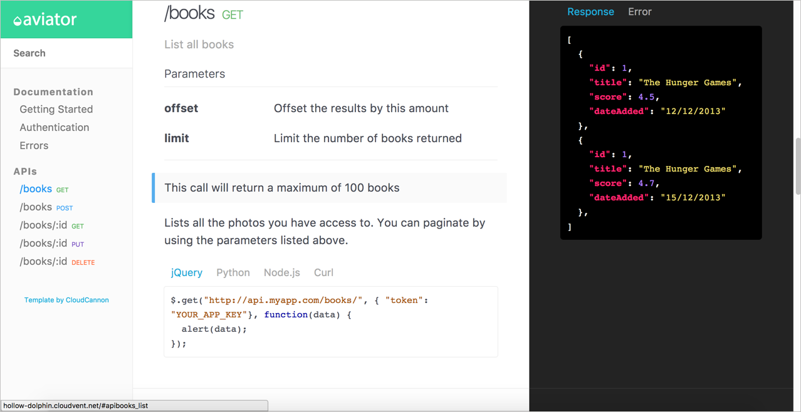
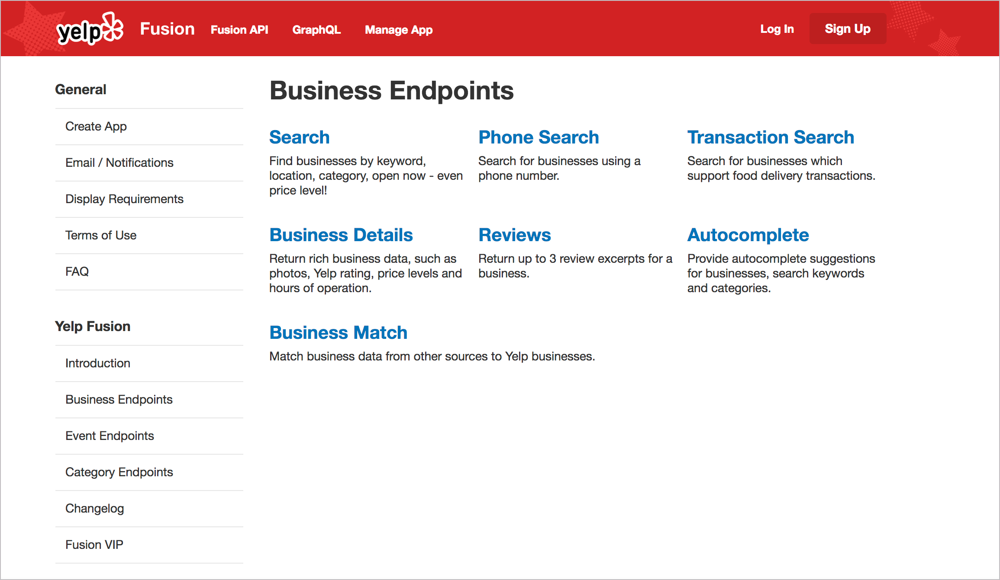

# Шаблоны проектирования сайтов API документации

В предыдущем разделе мы просмотрели длинный список сайтов документации API и искали похожие шаблоны в их дизайне. Шаблоны проектирования - это общие подходы или методики проектирования чего-либо. Хотя можно определить гораздо больше шаблонов, следующие шаблоны дизайна являются общими для сайтов документов API:

- структура и шаблоны,
- единый цельный веб-сайт,
- множество примеров кода,
- длинные страницы,
- интерактивные API explorers.

Каждый из этих элементов мы рассмотрим в этом разделе.

[Паттерн 1: Структура и шаблоны](#first)

[Паттерн 2: единый цельный веб-сайт](#second)

[Паттерн 3: множество примеров кода](#third)

[Паттерн 4: длинные страницы](#fourth)

[Паттерн 5: Интерактивность API](#fifth)

[Некоторое отсутствие шаблонов на сайтах API документации](#nonPattern)

## Паттерн 1: Структура и шаблоны

Одной из основных общих черт сайтов документации API является то, что они имеют общую структуру, особенно это касается документации конечных точек. В модуле [Документирование конечных точек API](https://github.com/Starkovden/Documenting_APIs/tree/master/3.%20Documenting%20API%20endpoints#%D0%B4%D0%BE%D0%BA%D1%83%D0%BC%D0%B5%D0%BD%D1%82%D0%B8%D1%80%D0%BE%D0%B2%D0%B0%D0%BD%D0%B8%D0%B5-%D0%BA%D0%BE%D0%BD%D0%B5%D1%87%D0%BD%D1%8B%D1%85-%D1%82%D0%BE%D1%87%D0%B5%D0%BA) мы рассмотрели общие разделы в документации конечных точек API.

С точки зрения инструмента, если есть общие разделы для каждой конечной точки, имеет смысл формализовать шаблон для размещения публикации этого контента. Шаблон может обеспечить согласованность, автоматизировать публикацию и стили, а также упростить изменение дизайна без ручного переформатирования каждого раздела. (Без шаблона можно просто забыть добавить одни и те же разделы на каждой странице, что требует больше усилий для обеспечения согласованности.) С помощью шаблона можно вставлять различные значения (описания, методы, параметры и т.д.) в вывод, в комплекте со сложным стилем.

Различные инструменты имеют разные способы обработки шаблонов. В [Jekyll](https://github.com/Starkovden/Documenting_APIs/blob/master/7.%20Publishing%20your%20API%20documentation/7.14.%20Jekyll%20and%20CloudCannon%20continous%20deployment%20tutorial.md#%D0%BD%D0%B5%D0%BF%D1%80%D0%B5%D1%80%D1%8B%D0%B2%D0%BD%D0%BE%D0%B5-%D1%80%D0%B0%D0%B7%D0%B2%D0%B5%D1%80%D1%82%D1%8B%D0%B2%D0%B0%D0%BD%D0%B8%D0%B5-jekyll-%D0%B8-cloudcannon), генераторе статических сайтов, можно создавать значения в [файле YAML](https://github.com/Starkovden/Documenting_APIs/blob/master/4.%20OpenAPI%20specification%20and%20Swagger/4.3.%20Working%20in%20YAML.md#%D1%80%D0%B0%D0%B1%D0%BE%D1%82%D0%B0-%D0%B2-yaml) и идти по ним, используя Liquid для доступа к значениям.

Вот как можно это делать. Во frontmatter страницы (например, endpoints.yml) можно перечислить пары ключ-значение для каждого раздела.

    resource_name: surfreport
    resource_description: Gets the surf conditions for a specific beach.
    endpoint: /surfreport

и так далее.

После чего можно использовать [цикл for](https://help.shopify.com/en/themes/liquid/objects/for-loops) для циклического перебора каждого из элементов и вставки их в шаблон:

    
    
{{p.resource_name}}

    
{{p.resource_description}}

    
{{p.endpoint}}

    

Такой подход позволяет легко менять шаблон без переформатирования всех страниц. Если нужно будет изменить порядок элементов на странице, или добавить новые классы или другое значение, просто меняется шаблон. Значения остаются неизменными, так как они могут быть обработаны в любом порядке.

Полноценным примером API-шаблонов является [Тема Aviator от CloudCannon](https://github.com/CloudCannon/aviator-jekyll-template). Пример конечной точки для добавления книг в теме «Авиатор» выглядит следующим образом:

    ---
    title: /books
    position: 1.1
    type: post
    description: Create Book
    right_code: |
      ~~~ json
      {
        "id": 3,
        "title": "The Book Thief",
        "score": 4.3,
        "dateAdded": "5/1/2015"
      }
      ~~~
      {: title="Response" }

      ~~~ json
      {
        "error": true,
        "message": "Invalid score"
      }
      ~~~
      {: title="Error" }
    ---
    title
    : The title for the book

    score
    : The book's score between 0 and 5

    The book will automatically be added to your reading list
    {: .success }

    Adds a book to your collection.

    ~~~ javascript
    $.post("http://api.myapp.com/books/", {
      "token": "YOUR_APP_KEY",
      "title": "The Book Thief",
      "score": 4.3
    }, function(data) {
      alert(data);
    });
    ~~~
    {: title="jQuery" }

(`~~~` - это альтернативная разметка для обратного апострофа. Обозначение `{: .success}` - это синтаксис [kramdown](https://kramdown.gettalong.org/) для пользовательских классов.) Автор темы создал макет, который просматривает эти значения и помещает содержимое в формат HTML. Если вы посмотрите [файл index.html в Aviator](), вы увидите следующий код:

    
    
      
      
         <section class="doc-content">
           <section class="left-docs">
             <h3>
               <a id="{{ doc.id | replace: '/', '' | replace: '.', '' }}">
                 {{ doc.title }}
                 
                 
                 
               </a>
             </h3>
             
             
{{doc.description}}

             
             {{ doc.content | replace: "<dl>", "<h6>Parameters</h6><dl>" }}
             </section>
             
             <section class="right-code">
               {{ doc.right_code | markdownify }}
             </section>
             
           </section>
           
    

Этот код использует циклы `for` в [сценариях Liquid](https://help.shopify.com/en/themes/liquid/basics) для итерации по элементам в коллекции `docs` и вставляет содержимое в стили HTML шаблона. Результат выглядит так:

Такая структура действительно необходима, только при наличии многих разных конечных точек. Если их несколько, нет необходимости автоматизировать процесс шаблона.

Jekyll здесь только в качестве примера. Многие из веб-платформ и технологий, используемых для документации API, реализуют аналогичный шаблонный подход.

Игровой стартап Badgeville публикует документы с использованием Drupal. Их дизайнерское агентство разработало шаблон в Drupal. Для публикации справочной документации API, инженеры написали собственный скрипт, который сгенерировал контент из базы данных в файл JSON, который затем импортировался в Drupal. В процесс импорта поля заполнялись в шаблоне Drupal.

В результате получился сногсшибательный, визуально привлекательный дизайн. Чтобы достичь такого стиля в UX, потребовалось бы множество пользовательских тегов `div` для применения классов и других сценариев на странице. Отделяя контент от формата шаблона, можно работать с контентом, не беспокоясь о правильных тегах стиля и другом форматировании. При поиске инструментов документирования нужно помнить о необходимости шаблонизировать справочную документацию API.

Может быть весело создавать свои собственные шаблоны (если вы хотите поработать с документами), но могут возникнуть и  проблемы, связанные с пользовательскими шаблонами. Шаблоны полностью произвольны, с терминами и структурой, основанными на предполагаемых потребностях и стилях дизайнера. Если будем писать документацию для конкретного шаблона, что произойдет, если захотим переключить темы или продукты? Придется создавать новые шаблоны, которые будут обрабатывать один и тот же пользовательский frontmatter, а это означает большое количество кода.

Учитывая, что API-интерфейсы REST соответствуют сходным характеристикам и разделам, не имеет ли смысла создавать стандарт в способе описания API-интерфейсов, а затем использовать инструменты, которые анализируют эти стандартные описания? Да! Вот что такое спецификация OpenAPI. В этом курсе есть пояснения [нескольких форматов описания API REST](https://github.com/Starkovden/Documenting_APIs/blob/master/4.%20OpenAPI%20specification%20and%20Swagger/4.1.%20Overview%20of%20REST%20API%20specification%20formats.md#%D0%BE%D0%B1%D0%B7%D0%BE%D1%80-%D1%84%D0%BE%D1%80%D0%BC%D0%B0%D1%82%D0%BE%D0%B2-%D1%81%D0%BF%D0%B5%D1%86%D0%B8%D1%84%D0%B8%D0%BA%D0%B0%D1%86%D0%B8%D0%B9-rest-api), а также [обширное руководство по спецификации OpenAPI](https://github.com/Starkovden/Documenting_APIs/blob/master/4.%20OpenAPI%20specification%20and%20Swagger/4.4.%20OpenAPI%20tutorial%20overview.md#%D0%BE%D0%B1%D0%B7%D0%BE%D1%80-%D1%80%D1%83%D0%BA%D0%BE%D0%B2%D0%BE%D0%B4%D1%81%D1%82%D0%B2%D0%B0-openapi-30). Есть также и учебное пособие по чтению спецификации OpenAPI при помощи [Swagger UI](https://github.com/Starkovden/Documenting_APIs/blob/master/4.%20OpenAPI%20specification%20and%20Swagger/4.14.%20Swagger%20UI%20tutorial.md#%D1%80%D1%83%D0%BA%D0%BE%D0%B2%D0%BE%D0%B4%D1%81%D1%82%D0%B2%D0%BE-swagger-ui), а также [задание по созданию собственного Swagger UI](https://github.com/Starkovden/Documenting_APIs/blob/master/4.%20OpenAPI%20specification%20and%20Swagger/4.14.%20Swagger%20UI%20tutorial.md#-%D0%BF%D1%80%D0%B0%D0%BA%D1%82%D0%B8%D1%87%D0%B5%D1%81%D0%BA%D0%BE%D0%B5-%D0%B7%D0%B0%D0%BD%D1%8F%D1%82%D0%B8%D0%B5-%D1%81%D0%BE%D0%B7%D0%B4%D0%B0%D0%BD%D0%B8%D0%B5-%D1%81%D0%BF%D0%B5%D1%86%D0%B8%D1%84%D0%B8%D0%BA%D0%B0%D1%86%D0%B8%D0%B8-openapi-%D0%B2-swagger-ui).

Задача этого курса заключается в том, что бы не перегружать технических писателей проблемами кодирования при создании собственных шаблонов API. Тема Aviator демонстрирует один индивидуальный подход, и он выделен здесь с примерами кода, чтобы продемонстрировать сложность и индивидуальность определения собственных шаблонов. Но это не единственный подход и даже не рекомендуемый подход.

## Паттерн 2: Единый цельный веб-сайт

Многие API-сайты предоставляют *один интегрированный веб-сайт* для представления всей информации. Справка не открывается в новом окне, отдельно от другого контента. Веб-сайт имеет такой же внешний вид, как и продукт. Вот пример из Yelp:

Как уже упоминалось ранее в разделе [Рынок документации REST API](https://github.com/Starkovden/Documenting_APIs/blob/master/1.%20Introduction%20to%20REST%20APIs/1.7.The%20market%20for%20REST%20API%20documentation.md#%D1%80%D1%8B%D0%BD%D0%BE%D0%BA-api-%D0%B4%D0%BE%D0%BA%D1%83%D0%BC%D0%B5%D0%BD%D1%82%D0%B8%D1%80%D0%BE%D0%B2%D0%B0%D0%BD%D0%B8%D1%8F), документация API обычно не имеет графического интерфейса пользователя (GUI), который дополняет ее. В большинстве случаев сама документация API - это и есть интерфейс, по которому пользователи переходят к использованию продукта. Таким образом, пользователи будут ожидать от такого продукта большего.

Одной из проблем использования документации, сгенерированной в [OpenAPI и Swagger](https://github.com/Starkovden/Documenting_APIs/blob/master/4.%20OpenAPI%20specification%20and%20Swagger/4.2.%20Introduction%20to%20the%20OpenAPI%20spec%20and%20Swagger.md#%D0%B7%D0%BD%D0%B0%D0%BA%D0%BE%D0%BC%D1%81%D1%82%D0%B2%D0%BE-%D1%81%D0%BE-%D1%81%D0%BF%D0%B5%D1%86%D0%B8%D1%84%D0%B8%D0%BA%D0%B0%D1%86%D0%B8%D1%8F%D0%BC%D0%B8-openapi-%D0%B8-swagger) или другого инструмента генерации документов, является выяснение того, как интегрировать ее с остальной частью сайта. В идеале нужно, чтобы пользователи имели беспроблемный доступ ко всему сайту. Если конечные точки отображаются в отдельном представлении, как интегрировать ссылку на конечную точку в остальную часть документации?

Интеграция брендинг с поиском может не заинтересовать пользователей. Но если создается впечатление, что пользователи перемещаются по нескольким сайтам, к тому же плохо объединенным в единое целое, взаимодействие с UX будет нарушено.

Стоит подумать о другом контенте, с которым пользователи будут взаимодействовать. Например, о маркетинговом контенте, условиях обслуживания, поддержке и т.д. Как собрать всю эту информацию в единый сайт, не прибегая к перегруженной CMS или какой-либо другой веб-среде?

Реальность такова: большинство сайтов документации API являются специально разработанными веб-сайтами, которые органично сочетаются с другим маркетинговым контентом на сайте, потому что документ API должен продавать API. В качестве платформы веб-сайта (а не справки по Tripane) можно использовать все методы HTML, CSS и JS, доступные при создании веб-сайтов. Нет ограничения небольшого доступных инструментов, которые используются для создания справки; вместо этого в распоряжении мы имеем полный набор веб-инструментов.

Открытое приглашение использовать веб-инструменты для создания своего сайта API-документации является как преимуществом, так и проблемой. Преимущество в том, что, по большей части, ничего нельзя сделать со своей документацией. Ограничения только в отсутствии знаний о frontend'e. Но это также проблема, потому что многие из потребностей в документах (единый источник, PDF, переменные и т.д .) могут быть недоступны для большинства веб-инструментов.

## Паттерн 3: Множество примеров кода

Больше всего на свете разработчики любят [примеры кода](https://github.com/Starkovden/Documenting_APIs/blob/master/6.%20Non-reference%20API%20topics/6.7.%20Code%20samples%20and%20tutorials.md#%D0%BE%D0%BF%D0%B8%D1%81%D0%B0%D0%BD%D0%B8%D0%B5-%D0%B8-%D0%BE%D0%B1%D1%80%D0%B0%D0%B7%D1%86%D1%8B-%D0%BA%D0%BE%D0%B4%D0%B0), и обилие выделенного синтаксиса. Правильно отформатированный пример кода на сайте API тоже представляет шаблон дизайна. Чем больше кода можно добавить в свою документацию, тем лучше. Вот пример из API Evernote:

Джеймс Ю из компании Parse дает следующий совет:

> Разбросайте побольше примеров из реальной жизни по всей документации. Ни один разработчик не будет жаловаться на то, что примеров слишком много. Они значительно сокращают время, необходимое для разработчиков, чтобы понять продукт. На самом деле, у нас даже есть пример кода прямо на нашей домашней странице. ([Designing Great API Docs](https://www.pixelstech.net/article/1331352900-Designing-Great-API-Docs))

Используя примеры кода всегда хочется включить подсветку синтаксиса. Подсветка синтаксиса окрашивает различные элементы примера кода соответствующим образом в зависимости от языка программирования. Существует множество видов подсветки синтаксиса, которые обычно можно включать в свою платформу. Например, Jekyll по умолчанию использует [Rouge](https://github.com/jneen/rouge). Другим распространенным маркером являются [Pygments](http://pygments.org/). Эти маркеры имеют таблицы стилей, подготовленные для выделения языков на основе определенного синтаксиса.

## Паттерн 4: Длинные страницы

## Паттерн 5: Интерактивность API

## Некоторое отсутствие шаблонов на сайтах API документации
