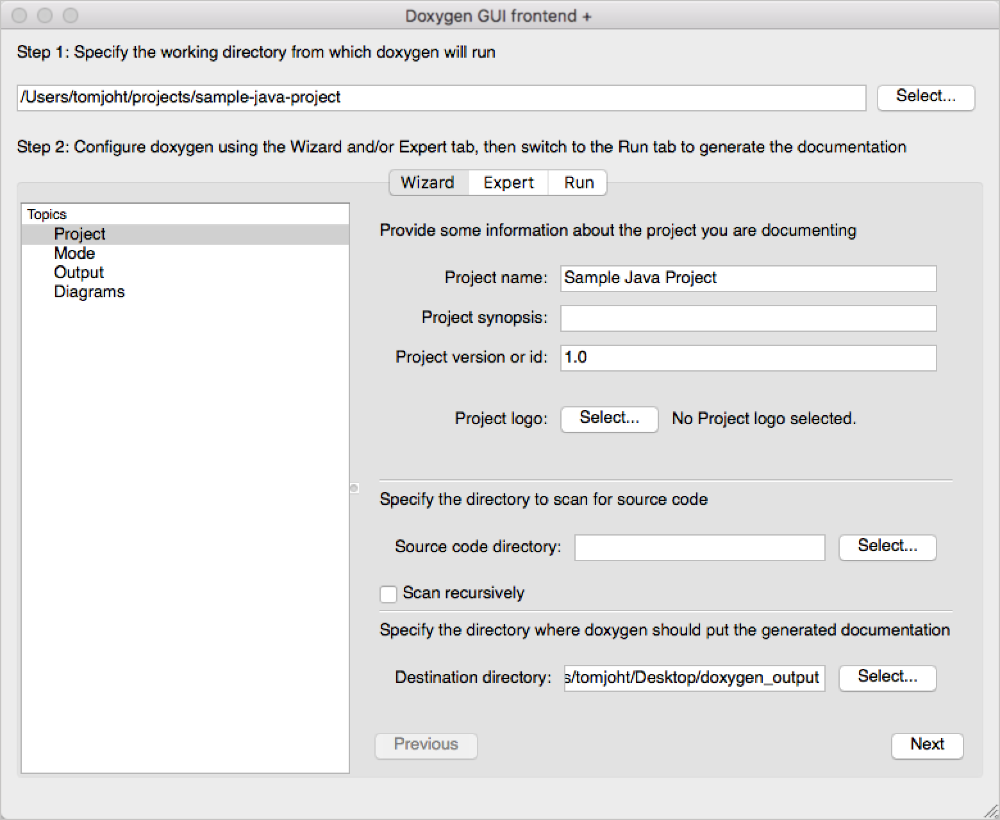
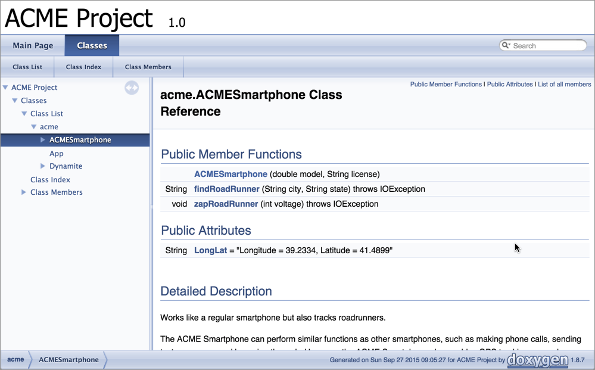

# Doxygen, генератор документации в основном для С++

Альтернативой Javadoc является Doxygen. Doxygen очень похож на Javadoc, за исключением того, что он может обрабатывать больше языков (Java, C++, C# и другие). Doxygen чаще всего используется для C++. Кроме того, есть инструмент с графическим интерфейсом под названием Doxywizard, который облегчает создание файла.

[Скачиваем Doxywizard](#Doxywizard)

[Автоматическая интеграция сборок](#integrating)

[Другие генераторы документации](#otherGenerators)

## Скачиваем Doxywizard

При скачивании Doxygen также получаем и Doxywizard. Дополнительные ссылки для скачивания можно найти на странице загрузок [Doxygen](http://www.doxygen.nl/download.html).

Интерфейс генератора Doxywizard выглядит так:

Отображение документации Doxygen будет таким:

Сам Doxywizard необязательно использовать. Можно генерировать Doxygen с помощью файла конфигурации. Как правило, разработчики запускают сборки Doxygen с сервера.

В отличие от Javadoc, Doxygen позволяет включать внешние файлы, записанные в Markdown. И Doxygen предоставляет функцию поиска. Это две особенности, которые отсутствуют в Javadoc.

Doxygen поддерживается одним разработчиком и, как и Javadoc, не сильно изменился за долгие годы. Интерфейс может быть, сильно устарел и несколько запутан. Но разработчики C++ привыкнут к этому.

## Автоматическая интеграция сборок

Во многих IT-компаниях генераторы документов автоматически интегрируются в процесс сборки программного обеспечения. Doxygen позволяет создавать файл конфигурации, который можно запускать из командной строки (без помощи графического интерфейса). Это означает, что когда разработчики собирают программное обеспечение, справочная документация автоматически создается и включается в выходные данные.

## Другие генераторы документации

Не нужно ограничивать себя либо Javadoc, либо Doxygen. Существуют десятки различных генераторов документов для разных языков. По запросу «генератор документов + {язык программирования}» можно найти много инструментов. Тем не менее, не стоит увлекаться такими инструментов. Генераторы документов несколько устарели, создают статические интерфейсы, которые выглядят такими же устаревшими, часто написаны инженерами для других инженеров и не очень гибкие.

Возможно, самым большим разочарованием для генераторов документов является то, что в них нельзя интегрировать остальную часть своей документации. Например, застряли с выводом справочной документации. Еще необходимо сгенерировать практические руководства и другие учебные пособия, а затем создать ссылку на справочную документацию. Таким образом, не будет единого интегрированного опыта документирования. Кроме того, будет трудно создавать встроенные ссылки в разделах между двумя выходами. Тема фрагментации результатов подробно рассматривали в разделе [Интеграция Swagger с документацией](../openAPI-specification/integrating-swagger-with-docs.md).
