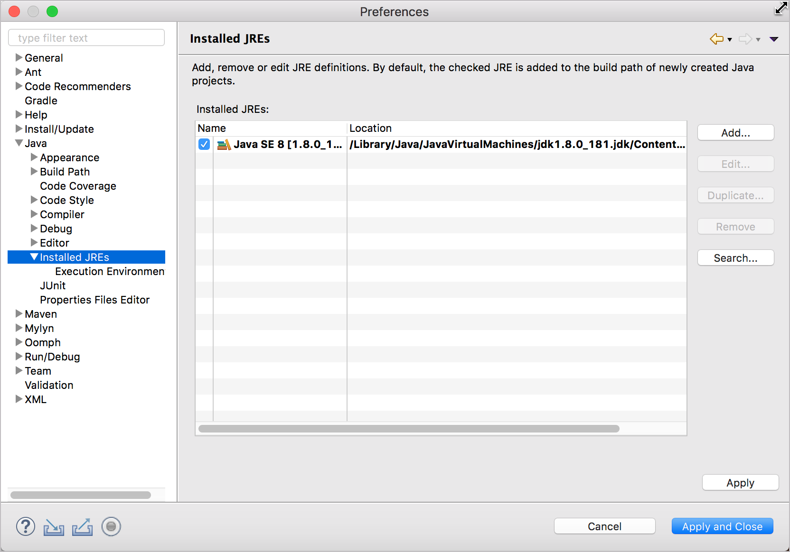

# Обзор нативных библиотек API

В большей части этого курса мы сосредоточились на [REST API](../introduction-rest-apis/what-is-rest-api.md). В этом разделе мы рассмотрим API-интерфейсы нативных библиотек, которые более распространены при создании нативных приложений, которые устанавливаются на устройства (например, устройства Android или iOS). Понимание API-интерфейсов нативных библиотек также поможет выяснить, чем же отличаются API-интерфейсы REST.

[Характеристики нативных библиотек API](#characteristics)

[Нужно ли быть программистом для документирования нативных библиотек API](#programmer)

[Подход автора к преподаванию нативной библиотеки API](#approach)

[Что нужно установить](#install)

- [Java Development Kit (JDK)](#jdk)

- [Eclipse IDE for Java Developers](#eclipse)

<a name="characteristics"></a>
## Характеристики нативных библиотек API

Нативные библиотеки API-интерфейсы (также называемые API на основе классов или просто API) заметно отличаются следующим:

- **Устанавливается локально.** API-интерфейсы нативных библиотек устанавливаются локально, компилируются в код как дополнительная библиотека. Затем программист может использовать классы, методы или другие функции, доступные в библиотеке. (Часть API относится к открытым классам, которые разработчики используют для доступа к функциям в библиотеке. Вероятно, в библиотеке Java есть много вспомогательных и служебных классов, которые не являются общедоступными, но пользователи будут взаимодействовать только с открытыми классами.);
- **Нет запросов и ответов.** Классы в нативных библиотеках API не используют протокол HTTP, а запросы и ответы не отправляются через Интернет. API нативных библиотек состоят из набора классов или функций, которые расширяют возможности существующего проекта. API полностью локальны, без веб-связи;
- **Специфический Язык.** Нативные библиотеки зависят от языка. Существует столько же типов API, сколько и языков программирования, более или менее. Существуют Java API, Python API, C ++ API, C # или .NET API, JavaScript API и так далее;
- **Требуются некоторые знания программирования для документирования.** Чтобы понять, как работает API, необходимо иметь общее представление о языке программирования. Программистом быть не нужно, но нужно быть знакомым с особенностями языка программирования, правильными терминами, с тем, как разные части сочетаются друг с другом, и как разработчики будут использовать API.

В этом модуле сосредоточимся на Java API, потому что они, являются одними из самых распространенных. Однако многие из упомянутых здесь концепций и соглашений о коде могут применяться и к другим языкам с небольшими отличиями.


<a name="programmer"></a>
## Нужно ли быть программистом для документирования нативных библиотек API

Поскольку нативные библиотеки API зависимы от конкретного языка программирования, документация обычно пишется или управляется инженерами, а не техническими писателями. Нативные библиотеки API - это одна из областей, в которой лучше быть бывшим разработчиком программного обеспечения для написания документации.

Тем не менее, техническому писателю не нужно быть программистом. Просто нужно минимальное понимание языка. Технические писатели могут внести здесь большой вклад в отношении стиля, последовательности, ясности, маркировки и общего профессионализма.

Существует множество книг и онлайн-ресурсов, с которыми вы можете ознакомиться, чтобы выучить определенный язык программирования. В этом модуле курса не будет попыток всестороннего [изучения Java](Java-crash-course.md). Однако, чтобы немного понять документацию по API Java (которая использует генератор документов под названием [Javadoc](https://www.oracle.com/technetwork/articles/java/index-jsp-135444.html) ), понадобится некоторое понимание Java.

Чтобы сосредоточиться на документации API, мы будем ориентироваться на документацию при изучении Java. Изучим различные части Java, просмотрев конкретный файл Javadoc и разобрав основные компоненты.

<a name="approach"></a>
## Подход автора к преподаванию нативной библиотеки API

Существует множество книг и онлайн-ресурсов, с которыми вы можете ознакомиться, чтобы выучить определенный язык программирования. В этом модуле курса не будет попыток всестороннего [изучения Java](Java-crash-course.md). Однако, чтобы немного понять документацию по API Java (которая использует генератор документов под названием [Javadoc](https://www.oracle.com/technetwork/articles/java/index-jsp-135444.html) ), понадобится некоторое понимание Java.

Чтобы сосредоточиться на документации API, мы будем ориентироваться на документацию при изучении Java. Изучим различные части Java, просмотрев конкретный файл Javadoc и разобрав основные компоненты.

<a name="install"></a>
## Что нужно установить

Для этой части курса вам необходимо установить [Java Development Kit (JDK)](#jdk) и [Eclipse IDE для разработчиков Java](#eclipse).

<a name="jdk"></a>
### Java Development Kit (JDK)

Сначала проверим, не установлена ли уже JDK на компьютере:

- Для MacOS в терминал впишем команду `java -version`;
- Для windows в командной строке наберем `where java`.

Если JDK установлена, то увидим примерно такое сообщение:

```
java version "1.8.0_181"
Java(TM) SE Runtime Environment (build 1.8.0_181-b13)
Java HotSpot(TM) 64-Bit Server VM (build 25.181-b13, mixed mode)
```

Если JDK не установлен, можно скачать JDK [здесь](https://www.oracle.com/technetwork/java/javase/downloads/index.html). Надо нажать кнопку `Java` и выбрать соответствующую загрузку для компьютера.

<a name="eclipse"></a>
### Eclipse IDE for Java Developers

Скачиваем и устанавливаем  [Eclipse IDE for Java Developers](https://www.eclipse.org/downloads/packages/)

<p align="left"></p>


Запускаем Eclipse. Когда будет предложено выбрать рабочее пространство, выбираем местоположение по умолчанию и нажимаем `Launch`. Закрываем вкладку приветствия.

Чтобы убедиться, что Eclipse настроен для использования версии 1.8, перейдите в **Eclipse> Preferences**, а затем **Java> Installed JREs**.



Если 1.8 не выбран, переходим в каталог установки (На MacOS это `/Library/Java/JavaVirtualMachines/jdk1.8.0_171.jdk/Contents/Home`) и выбираем ее.

Поскольку мы будем использовать Java только в контексте Eclipse, пользователям Windows не нужно добавлять Java в их путь к классам. Но если нужно иметь возможность компилировать Java из командной строки, тогда это нужно сделать.
