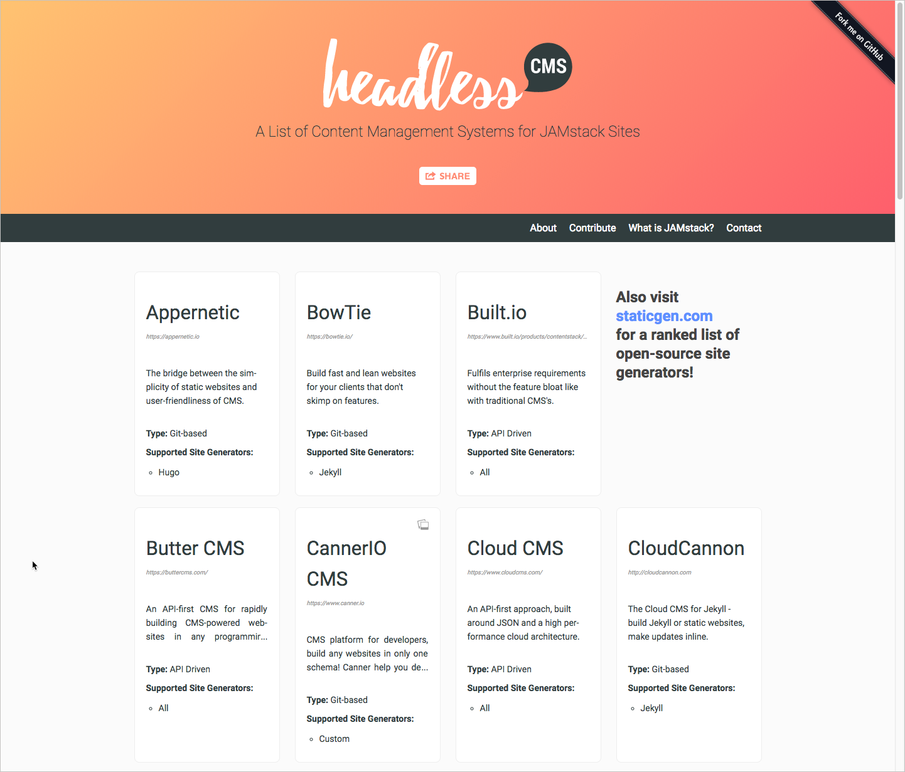
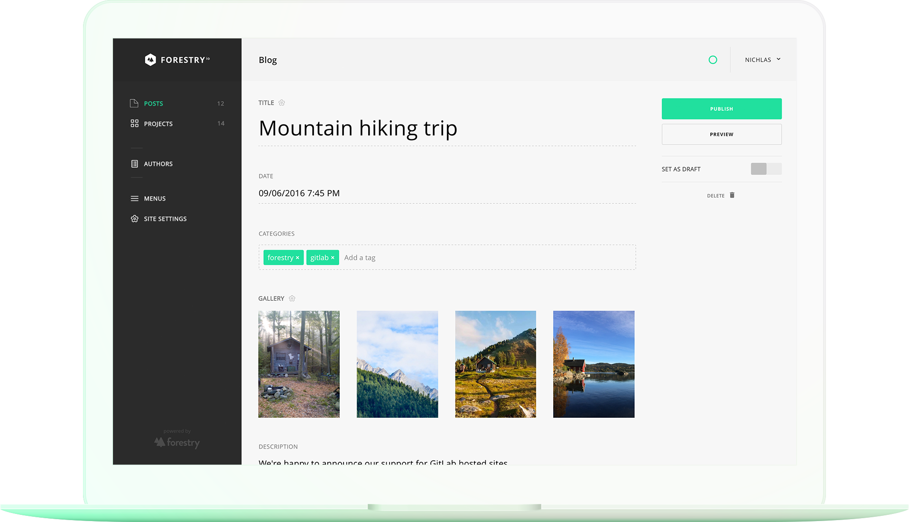
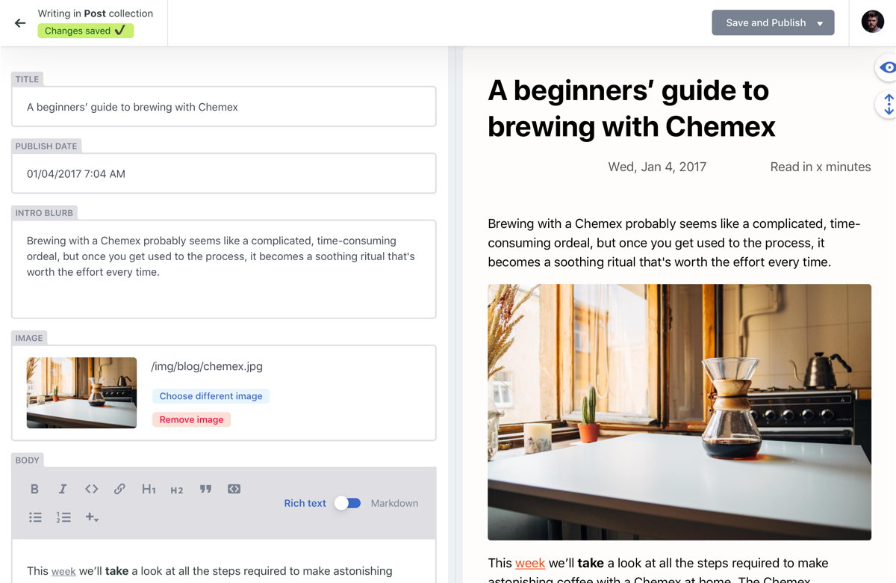
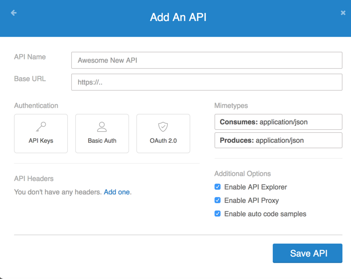
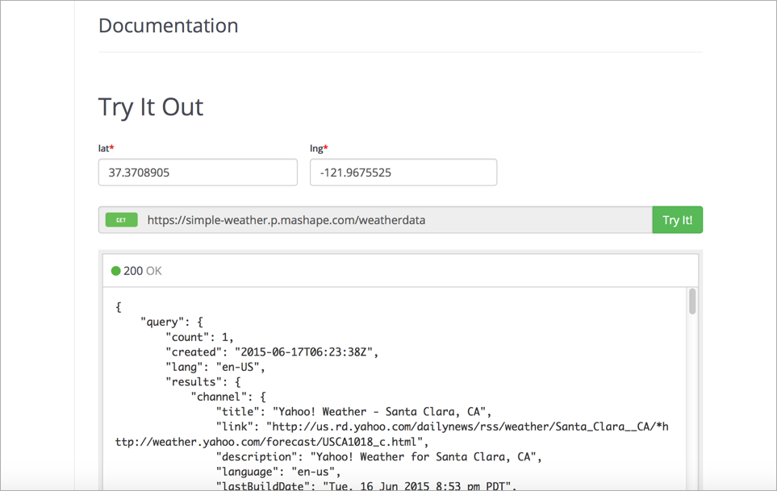

# Возможности автономных CMS (и Readme.io)

Завершая обзор инструментов публикации, рассмотрим класс инструментов для разработчиков, которые предоставляют интерактивные графические интерфейсы для создания контента и его публикации, но они по-прежнему хранят контент в виде плоских файлов в репозиториях, таких как GitHub и Bitbucket. Другими словами, они обеспечивают подобный [WordPress.com](https://ru.wordpress.com/) интерфейс для контента (предоставляя пользовательский интерфейс для просмотра сообщений, страниц, макетов и другого контента), но позволяют контенту жить в виде простых текстовых файлов в системах контроля версий. Такой тип инструментов называется «автономная CMS», потому что ему не хватает заголовка (базы данных) в качестве источника контента.

[Список возможностей автономных CMS](#list)

[Forestry.io](#forestry)

[Netlify CMS](#netlify)

[Readme.io](#readme)

## Список возможностей автономных CMS

Аналогично [staticgen.com](https://www.staticgen.com/), в котором перечислены распространенные генераторы статичных сайтов, существует и каталог [автономных систем управления контентом](https://headlesscms.org/), который упорядочен в алфавитном порядке (а не по популярности).

Автономные CMS часто объединяют разработку и хостинг/развертывание в одном инструменте. Внесенные обновления создаются автоматически на платформе. Но в отличие от WordPress, такое решение не включает в себя хранение документации в базе данных и динамическое извлечение контента из базы данных, при посещении страницы пользователями. При охранении контента на GitHub автономная CMS будет легко считывать и извлекать его. (Платформа, вероятно, будет содержать какую-то базу данных профиля и других функций CMS, но там не сохраняется и не восстанавливается контент.)

## Forestry.io

[Forestry.io](https://forestry.io/) похож на CloudCannon тем, что он предлагает онлайн-хостинг для проектов Jekyll, но также предоставляет хостинг для [Hugo](https://gohugo.io/) и Git. В центре внимания Forestry лежит предоставление онлайн-интерфейса CMS для генераторов статических сайтов. Интерфейс CMS предоставляет подобный WordPress графический интерфейс для просмотра и управления контентом.

Идея, лежащая в основе интерфейса CMS, заключается в том, что большинство генераторов статичных сайтов подвергают остракизму со стороны технических пользователей, заставляя их разбираться с кодом. (Например, написание постов в Jekyll многим кажется  программированием, хотя посты пишутся в Markdown.) CMS более дружественная к нетехническим людям, при этом используя открытость и гибкость статической платформы генератора сайтов.

[CloudCannon](Hosting-and-deployment-options.md#cloudcannon) также можно рассматривать как автономную CMS, но больше она подходит для решений хостинга и развертывания, потому что она не уделяет особого внимания разработке в своем графическом интерфейсе. Forestry.io (в отличие от CloudCannon) также предлагает локальную корпоративную установку, чтобы вы могли размещать и управлять всей платформой за брандмауэром вашей компании.

## Netlify CMS

[Netlify CMS](https://www.netlifycms.org/) похожа на Forestry своим предложением системы управления контентом для генераторов статичных сайтов. Но вместо того, чтобы ограничивать генераторы статичных сайтов, которые можно использовать, он предоставляет более открытую оболочку платформы (созданную с помощью React, но использующую Git для управления контентом), которая интегрируется с любым генератором статичных сайтов.

Одним из ключевых преимуществ Netlify CMS является упрощение процесса разработки контента для менее технических пользователей. Можно стандартизировать авторинг через интерфейс. Netlify CMS позволяет сопоставить настраиваемые поля в выбранной теме с шаблоном графического интерфейса пользователя, как показано на рисунке ниже. Эти настраиваемые поля уменьшают вероятность того, что писатели могут использовать неправильный тег frontmatter на своих страницах (например, `intro_blurb` или `IntroBlurb` или `introBlurb`). Вот пример интерфейса:

Источник контента может храниться в GitHub, GitLab или BitBucket. Netlify CMS также интегрируется с Netlify, популярной службой хостинга и развертывания для статических проектов сайтов.

> Руководство по интеграции Jekyll с Netlify в разделе [Adding a CMS to Your Static Site With Netlify CMS](https://dzone.com/articles/adding-a-cms-to-your-static-site-with-netlify-cms). Или просто можно начать с [документации по Netlify CMS](https://www.netlifycms.org/docs/).

## Readme.io

[Readme.io](https://readme.io/) - это онлайн CMS для документации, которая предлагает один из самых надежных и полнофункциональных интерфейсов для документации для разработчиков. Readme.io - это не автономная CMS. Readme.io хранит контент в базе данных (хотя эта деталь не упоминается на их сайте). Возможно, не стоило включать Readme.io в этот раздел, но не ясно, где еще о нем написать, да и подобный CMS GUI делает его наиболее похожим на  автономную CMS.

Readme.io делает акцент на предоставлении интерфейса, который поможет легче писать документацию, основанную на передовых практиках и проектах. Readme.io предоставляет различные, экраны для навигации по процессам документации, предлагая заполнить формы. Например:

Что наиболее важно, Readme.io включает в себя специальные функции для отображения содержимого документации API. Можно добавлять информацию об API вручную, или импортировать [файл спецификации OpenAPI](../openAPI-specification/introduction-openapi-and-swagger.md). Есть возможность поэкспериментировать, выбрав один из [примеров OpenAPI](https://github.com/OAI/OpenAPI-Specification/tree/master/examples/v2.0/yaml), например [этот](https://raw.githubusercontent.com/OAI/OpenAPI-Specification/master/examples/v2.0/json/petstore-expanded.json). Интеграция Readme.io с OpenAPI вместе с другим содержимым документации помогает интегрировать выходные данные, которые часто разделяются. (Такая фрагментация является проблемой, о которой написано  в разделе [Интеграция Swagger UI с остальными документами](../openAPI-specification/integrating-swagger-with-docs.md).)

В целом, Readme.io предоставляет надежный графический интерфейс для создания документации API, который является более обширным и хорошо продуманным, чем практически любая другая доступная платформа. Выходные данные включают в себя интерактивный пробный опыт с конечными точками:

Такой опыт похож на Swagger тем, что ответ появляется непосредственно в документации. Этот API Explorer дает представление о данных, возвращаемых API.

Но есть и некоторые проблемы в Readme.io. CMS не бесплатна, поэтому понадобятся лицензии для каждого писателя. Кроме того, в настоящее время нет никаких функций переиспользования контента, поэтому, если есть несколько выводов для документации, которые используются в качестве единого источника, Readme.io может не подойти. Наконец, если нужно настроить свой собственный дизайн или реализовать функцию, которая не поддерживается, нельзя просто взломать код (хотя можно настроить таблицу стилей). В целом, с таким размещенным решением, как Readme.io, можно застрять в рамках ограничений платформы.

Несмотря на это, вывод тут прекрасный, и возможности этого сайта являются первоклассными. Платформа постоянно расширяется, появляются новые функции, и есть много известных компаний, размещающих документацию на Readme.io. Если есть вопрос о том, сколько времени потребуется для создания и развертывания собственного сайта документации, переход на такой сайт, как Readme.io, сэкономит много времени, что позволит сосредоточиться на контенте, а также придерживаться лучших практик дизайна сайта.

Вот несколько примеров API-сайтов, созданных с помощью Readme.io:

- [Validic](https://docs.validic.com/docs/getting-started)
- [Box API](https://developer.box.com/docs)
- [Coinbase API](https://developers.coinbase.com/api/v2#introduction)
- [Farmbase Software](https://software.farm.bot/docs)
