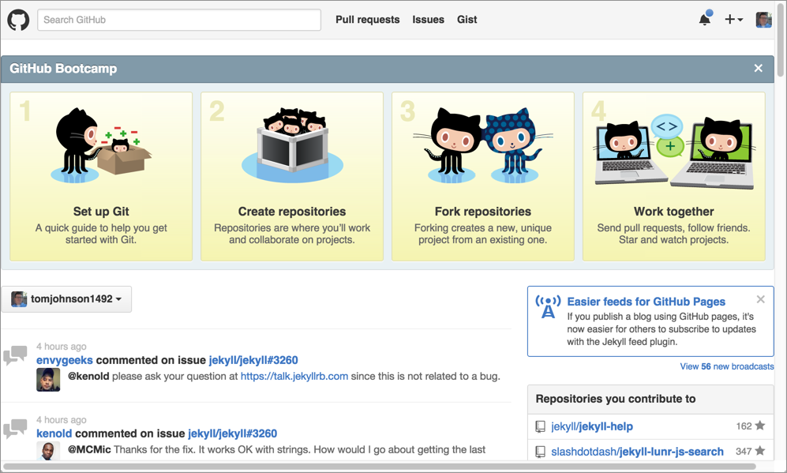

# Система контроля версий (пример Git)

Почти каждая ИТ-команда использует ту или иную форму контроля версий при разработке программного кода. Контроль версий - это то, как разработчики сотрудничают и управляют своей работой. Используя инструменты docs-as-code подразумевает и контроль версий, самым популярным инструментом которого является Git. Поскольку контроль версий является таким важным элементом для изучения, мы изучим его в этом и последующих разделах. Во многих отношениях освоение Git является более сложной задачей, чем изучение конкретного генератора статичных сайтов, такого как Jekyll или Hugo.

[Подключение к контролю версий](#plugging)

[Различные типы систем контроля версий](#types)

[Идея контроля версий](#idea)

[Основной рабочий процесс в контроле версий](#workflow)

[Ветвление](#branching)

## Подключение к контролю версий

При работе с документацией API, потребуется подключение к системе контроля версий команды разработчиков, чтобы получить код. Или можно создавать ветки, чтобы добавлять или редактировать документацию там.

Многие разработчики очень хорошо знакомы с системами версионирования, но, как правило, такие системы мало используются техническими писателями, потому что технические писатели традиционно работают с двоичными форматами файлов, такими как Microsoft Word и Adobe Framemaker. Бинарные форматы файлов доступны только для чтения на компьютерах, а системы контроля версий плохо справляются с управлением бинарными файлами, поскольку невозможно отследить изменения в разных версиях.

Работая с форматами текстовых файлов, можно интегрировать рабочий процесс документации в систему управления версиями. При этом откроется целый новый мир!

## Различные типы систем контроля версий

Существуют разные типы систем контроля версий. Централизованная система управления версиями требует, чтобы каждый пользователь проверял или синхронизировал файлы с центральным хранилищем при их редактировании.

Чаще всего разработчики программного обеспечения используют *распределенные* системы контроля версий. Наиболее распространенная система - это Git (вероятно, потому что GitHub предоставляет Git-репозитории бесплатно в Интернете). Есть и другие системы управления версиями, например: Mercurial, Subversion (SVN) и Perforce. Из-за популярности Git, на нем мы и сосредоточимся.

Git и GitHub - это две разные вещи. GitHub предоставляет онлайн-репозитории и инструменты для Git. GitHub - это платформа для управления проектами Git с приятным графическим интерфейсом для выполнения некоторых задач Git, таких например, как запросы на извлечение.

[Bitbucket](https://bitbucket.org/product) - это версия GitHub компании Altassian. Bitbucket позволяет использовать Git или Mercurial, но большинство проектов Bitbucket используют Git.

## Идея контроля версий

После установки программного обеспечения для контроля версий, такого как Git, и инициализации репозитория на компьютере, в созданном репозитории добавляется невидимая папка. Эта невидимая папка управляет версиями содержимого этой папки. (При перемещении отслеживания Git в другую папку, невидимая папка git должна переноситься в ту же папку.)

Добавляя файлы в Git и фиксируя их (создавая коммит), Git делает моментальный снимок зафиксированных файлов в этот момент времени. При фиксации другого изменения, Git создает еще один снимок. Если понадобиться вернуться к более ранней версии файла, нужно просто открыть определенный снимок. Такие снимки являются основной идеей создания версий контента.

## Основной рабочий процесс в контроле версий

В Интернете есть много отличных учебников по управлению версиями, посмотрим эти учебники за более подробной информацией (например [GIT HOW TO](https://githowto.com/ru), у которого есть и версия на русском языке). Git предоставляет несколько этапов для файлов. Вот общий рабочий процесс:

1. Сначала добавляем все файлы, которые Git будет отслеживать. То, что файлы находятся в инициализированном репозитории Git, не означает, что Git фактически отслеживает и контролирует их изменения. Только когда файл официально «добавлен» в проект Git, Git начинает отслеживать изменения в этом файле.
2. Любые измененные файлы, которые отслеживает Git, находятся в «промежуточной» области.
3. При фиксации файла (создание коммита), Git создает моментальный снимок файла в этот момент времени, к которому можно всегда вернуться при дальнейшей работе.
4. После фиксации, изменения отправляются в мастер (Push). После внесения изменений в мастер, локальная копия и ветка мастер синхронизируются.

## Ветвление

По умолчанию репозиторий Git является веткой master. При совместной работе с другими пользователями в рамках одного проекта обычно люди разветвляют основную ветку (master), вносят изменения в ветку, а затем объединяют (merge) ветку с веткой master.

Редакция аннотации документов в файлах кода следует тому же рабочему процессу - вносить изменения в определенную ветку документов. После редактирования создается запрос (pull request), чтобы разработчики слили ветку doc обратно в master.

После краткого введения в docs-as-code и контроль версий попробуем попрактиковаться, работая в Git:

- [Практическое занятие: Управляем контентом в Wiki Github](Manage-wiki-content.md)
- [Практическое занятие: Используем клиент GitHub для десктопа](Use-GitHub-Desktop.md)
