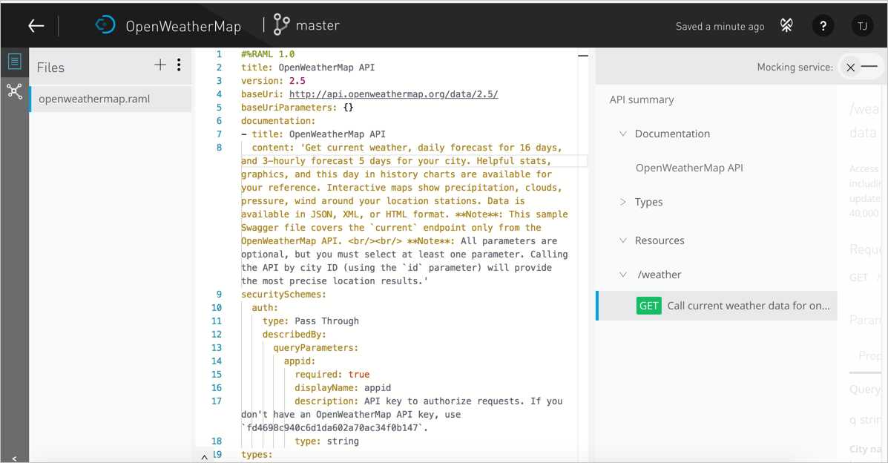
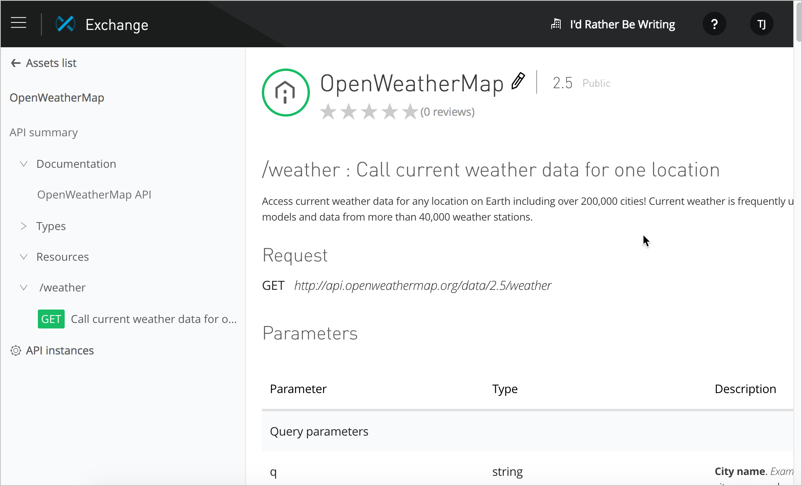
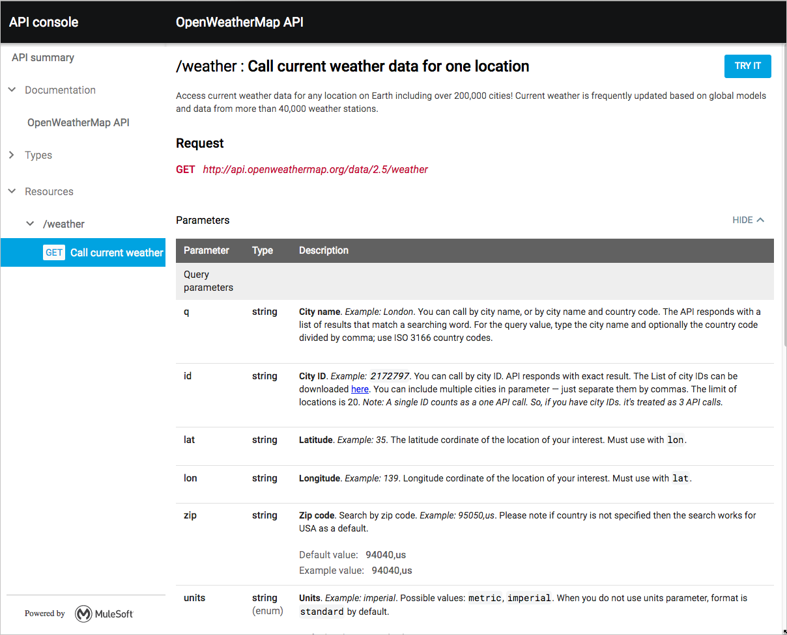

# Справочник RAML

RAML расшифровывается как REST API Modeling Language и аналогичен [спецификации OpenAPI](../openAPI-specification/openapi-tutorial-overview.md). RAML поддерживается [Mulesoft](https://www.mulesoft.com/), компанией, предоставляющей полный комплекс услуг API.

> Если документация не публикуется с помощью Mulesoft или другой платформы, которая требует RAML, рекомендуется вместо этого использовать [спецификацию OpenAPI](../openAPI-specification/openapi-tutorial-overview.md). Однако Mulesoft предлагает API-интерфейсы корпоративного уровня для проектирования, управления и развертывания. Если использовать Mulesoft для своего API, лучше использовать RAML для своей спецификации документации.

[Обзор RAML](#overview)

[Автогенерация кода клиентского SDK](#autogenerate)

[Пример спецификации для OpenWeatherMap API](@sample)

[Выводы](#outputs)

[Портал разработчиков на платформе Anypoint](#anypoint)

[Вывод API консоли](#consoleOutputs)

[Проект RAML2HTML](#raml2html)

[Заключение](#conclusion)


<a name="overview"></a>
## Обзор RAML

Как и в OpenAPI, после создания файла RAML, описывающего API, он может использоваться различными платформами для анализа и отображения информации в интерактивном выводе. Формат RAML, в котором используется синтаксис YML, чеовекочитаем, эффективен и прост. Вот как выглядит вывод RAML в консоли API (которая похожа на интерфейс Swagger):


Демо API Google Drive можно посмотреть [здесь](https://mulesoft.github.io/api-console/#docs/docs/summary)

<a name="autogenerate"></a>
## Автогенерация кода клиентского SDK

Важно отметить, что в этой спецификации REST API (как и в спецификации OpenAPI) мы не просто описываем API для создания превосходного вывода документации с помощью интерактивной консоли. Существуют инструменты, которые также могут генерировать клиентские SDK и другой код из спецификации в библиотеку, которую можно интегрировать в свой проект. Эти инструменты упрощают разработчикам осуществлять запросы к API и получать ответы.

Кроме того, интерактивная консоль может обеспечить возможность прототипирования и бета-тестирования API еще до того, как разработчики начнут программировать. Mulesoft предлагает «мок-сервис» для API, который имитирует вызовы и ответы. Идея мок-сервиса состоит в том, чтобы с самого начала правильно разработать свой API, без перебора различных версий, когда мы пытаемся получить конечные точки правильно.

<a name="sample"></a>
## Пример спецификации для OpenWeatherMap API

Чтобы понять синтаксис и формат RAML, нужно изучить [спецификацию RAML](https://github.com/raml-org/raml-spec/blob/master/versions/raml-10/raml-10.md/) и взглянуть на некоторые примеры. Для начала можно взглянуть на [справочник RAML](https://raml.org/developers/raml-100-tutorial).

Ниже приведен пример OpenWeatherMap API (которым мы [пользовались ранее на этом курсе](../like-developer/using-api-scenario.md) ), отформатированный в спецификации RAML. Для конвертации OpenAPI 3.0 в RAML можно воспользоваться [API Transformer](https://www.apimatic.io/transformer). Как видно RAML очень сильно похож на спецификацию OpenAPI.

```yaml
#%RAML 1.0
title: OpenWeatherMap API
version: 2.5
baseUri: https://mocksvc.mulesoft.com/mocks/082e051b-e960-48f7-9d75-2f49af8ccd86/data/2.5/ # baseUri: http://api.openweathermap.org/data/2.5/
baseUriParameters: {}
documentation:
- title: OpenWeatherMap API
  content: 'Get the current weather, daily forecast for 16 days, and a three-hour-interval forecast for 5 days for your city. Helpful stats, graphics, and this day in history charts are available for your reference. Interactive maps show precipitation, clouds, pressure, wind around your location stations. Data is available in JSON, XML, or HTML format. **Note**: This sample Swagger file covers the `current` endpoint only from the OpenWeatherMap API. <br/><br/> **Note**: All parameters are optional, but you must select at least one parameter. Calling the API by city ID (using the `id` parameter) will provide the most precise location results.'
securitySchemes:
  auth:
    type: Pass Through
    describedBy:
      queryParameters:
        appid:
          required: true
          displayName: appid
          description: API key to authorize requests. If you don't have an OpenWeatherMap API key, use `fd4698c940c6d1da602a70ac34f0b147`.
          type: string
types:
  SuccessfulResponse:
    displayName: Successful response
    type: object
    properties:
      coord:
        required: false
        displayName: coord
        type: Coord
      weather:
        required: false
        displayName: weather
        description: (more info Weather condition codes)
        type: array
        items:
          type: Weather
      base:
        required: false
        displayName: base
        description: Internal parameter
        type: string
      main:
        required: false
        displayName: main
        type: Main
      visibility:
        required: false
        displayName: visibility
        description: Visibility, meter
        type: integer
        format: int32
      wind:
        required: false
        displayName: wind
        type: Wind
      clouds:
        required: false
        displayName: clouds
        type: Clouds
      rain:
        required: false
        displayName: rain
        type: Rain
      snow:
        required: false
        displayName: snow
        type: Snow
      dt:
        required: false
        displayName: dt
        description: Time of data calculation, unix, UTC
        type: integer
        format: int32
      sys:
        required: false
        displayName: sys
        type: Sys
      id:
        required: false
        displayName: id
        description: City ID
        type: integer
        format: int32
      name:
        required: false
        displayName: name
        type: string
      cod:
        required: false
        displayName: cod
        description: Internal parameter
        type: integer
        format: int32
  Coord:
    displayName: Coord
    type: object
    properties:
      lon:
        required: false
        displayName: lon
        description: City geo location, longitude
        type: number
        format: double
      lat:
        required: false
        displayName: lat
        description: City geo location, latitude
        type: number
        format: double
  Weather:
    displayName: Weather
    type: object
    properties:
      id:
        required: false
        displayName: id
        description: Weather condition id
        type: integer
        format: int32
      main:
        required: false
        displayName: main
        description: Group of weather parameters (Rain, Snow, Extreme etc.)
        type: string
      description:
        required: false
        displayName: description
        description: Weather condition within the group
        type: string
      icon:
        required: false
        displayName: icon
        description: Weather icon id
        type: string
  Main:
    displayName: Main
    type: object
    properties:
      temp:
        required: false
        displayName: temp
        description: 'Temperature. Unit Default: Kelvin, Metric: Celsius, Imperial: Fahrenheit.'
        type: number
        format: double
      pressure:
        required: false
        displayName: pressure
        description: Atmospheric pressure (on the sea level, if there is no sea_level or grnd_level data), hPa
        type: integer
        format: int32
      humidity:
        required: false
        displayName: humidity
        description: Humidity, %
        type: integer
        format: int32
      temp_min:
        required: false
        displayName: temp_min
        description: 'Minimum temperature at the moment. This is deviation from current temp that is possible for large cities and megalopolises geographically expanded (use these parameter optionally). Unit Default: Kelvin, Metric: Celsius, Imperial: Fahrenheit.'
        type: number
        format: double
      temp_max:
        required: false
        displayName: temp_max
        description: 'Maximum temperature at the moment. This is deviation from current temp that is possible for large cities and megalopolises geographically expanded (use these parameter optionally). Unit Default: Kelvin, Metric: Celsius, Imperial: Fahrenheit.'
        type: number
        format: double
      sea_level:
        required: false
        displayName: sea_level
        description: Atmospheric pressure on the sea level, hPa
        type: number
        format: double
      grnd_level:
        required: false
        displayName: grnd_level
        description: Atmospheric pressure on the ground level, hPa
        type: number
        format: double
  Wind:
    displayName: Wind
    type: object
    properties:
      speed:
        required: false
        displayName: speed
        description: 'Wind speed. Unit Default: meter/sec, Metric: meter/sec, Imperial: miles/hour.'
        type: number
        format: double
      deg:
        required: false
        displayName: deg
        description: Wind direction, degrees (meteorological)
        type: integer
        format: int32
  Clouds:
    displayName: Clouds
    type: object
    properties:
      all:
        required: false
        displayName: all
        description: Cloudiness, %
        type: integer
        format: int32
  Rain:
    displayName: Rain
    type: object
    properties:
      3h:
        required: false
        displayName: 3h
        description: Rain volume for the last 3 hours
        type: integer
        format: int32
  Snow:
    displayName: Snow
    type: object
    properties:
      3h:
        required: false
        displayName: 3h
        description: Snow volume for the last 3 hours
        type: number
        format: double
  Sys:
    displayName: Sys
    type: object
    properties:
      type:
        required: false
        displayName: type
        description: Internal parameter
        type: integer
        format: int32
      id:
        required: false
        displayName: id
        description: Internal parameter
        type: integer
        format: int32
      message:
        required: false
        displayName: message
        description: Internal parameter
        type: number
        format: double
      country:
        required: false
        displayName: country
        description: Country code (GB, JP etc.)
        type: string
      sunrise:
        required: false
        displayName: sunrise
        description: Sunrise time, unix, UTC
        type: integer
        format: int32
      sunset:
        required: false
        displayName: sunset
        description: Sunset time, unix, UTC
        type: integer
        format: int32
/weather:
  get:
    displayName: Call current weather data for one location
    description: Access current weather data for any location on Earth including over 200,000 cities! Current weather is frequently updated based on global models and data from more than 40,000 weather stations.
    securedBy:
    - auth
    queryParameters:
      q:
        required: false
        displayName: q
        description: '**City name**. *Example: London*. You can call by city name, or by city name and country code. The API responds with a list of results that match a searching word. For the query value, type the city name and optionally the country code divided by a comma; use ISO 3166 country codes.'
        type: string
      id:
        required: false
        displayName: id
        description: "**City ID**. *Example: `2172797`*. You can call by city ID. The API responds with the exact result. The List of city IDs can be downloaded [here](http://bulk.openweathermap.org/sample/). You can include multiple cities in this parameter &mdash; just separate them by commas. The limit of locations is 20. *Note: A single ID counts as a one API call. So, if you have city IDs, it's treated as 3 API calls.*"
        type: string
      lat:
        required: false
        displayName: lat
        description: '**Latitude**. *Example: 35*. The latitude coordinate of the location of your interest. Must use with `lon`.'
        type: string
      lon:
        required: false
        displayName: lon
        description: '**Longitude**. *Example: 139*. Longitude coordinate of the location of your interest. Must use with `lat`.'
        type: string
      zip:
        required: false
        default: 94040,us
        example: 94040,us
        displayName: zip
        description: '**Zip code**. Search by zip code. *Example: 95050,us*. Please note that if the country is not specified, the search uses USA as a default.'
        type: string
      units:
        required: false
        default: standard
        example:
          value: imperial
        displayName: units
        description: '**Units**. *Example: imperial*. Possible values: `metric`, `imperial`. When you do not use the `units` parameter, the format is `standard` by default.'
        type: string
        enum:
        - standard
        - metric
        - imperial
      lang:
        required: false
        default: en
        example:
          value: en
        displayName: lang
        description: '**Language**. *Example: en*. You can use lang parameter to get the output in your language. We support the following languages that you can use with the corresponded lang values: Arabic - `ar`, Bulgarian - `bg`, Catalan - `ca`, Czech - `cz`, German - `de`, Greek - `el`, English - `en`, Persian (Farsi) - `fa`, Finnish - `fi`, French - `fr`, Galician - `gl`, Croatian - `hr`, Hungarian - `hu`, Italian - `it`, Japanese - `ja`, Korean - `kr`, Latvian - `la`, Lithuanian - `lt`, Macedonian - `mk`, Dutch - `nl`, Polish - `pl`, Portuguese - `pt`, Romanian - `ro`, Russian - `ru`, Swedish - `se`, Slovak - `sk`, Slovenian - `sl`, Spanish - `es`, Turkish - `tr`, Ukrainian - `ua`, Vietnamese - `vi`, Chinese Simplified - `zh_cn`, Chinese Traditional - `zh_tw`.'
        type: string
        enum:
        - ar
        - bg
        - ca
        - cz
        - de
        - el
        - en
        - fa
        - fi
        - fr
        - gl
        - hr
        - hu
        - it
        - ja
        - kr
        - la
        - lt
        - mk
        - nl
        - pl
        - pt
        - ro
        - ru
        - se
        - sk
        - sl
        - es
        - tr
        - ua
        - vi
        - zh_cn
        - zh_tw
      Mode:
        required: false
        default: json
        example:
          value: json
        displayName: Mode
        description: '**Mode**. *Example: html*. Determines the format of the response. Possible values are `xml` and `html`. If the mode parameter is empty, the format is `json` by default.'
        type: string
        enum:
        - json
        - xml
        - html
    responses:
      200:
        description: Successful response
        body:
          application/json:
            displayName: response
            description: Successful response
            type: SuccessfulResponse
      404:
        description: Not found response
        body: {}
```

Формат спецификации RAML очень похож на спецификацию OpenAPI. На самом деле нет большого смысла иметь несколько спецификаций для REST API, поэтому возможно, что через несколько лет RAML устареет.

<a name="outputs"></a>
## Выводы

Сгенерировать вывод спецификации RAML можно при помощи нескольких платформ. Вот три примера:

- [Портал разработчиков на платформе Anypoint](#anypoint). Этот вариант для разработки API на платформе Anypoint Mulesoft;
- [API console](#consoleOutputs). Такой вариант можно использовать для автономного вывода консоли API на свой сервер (Так же есть опция встраивания консоли в iframe);
- [Проект API2HTML](#api2html) Этот вариант можно использовать если нужно выводить информацию в виде простого HTML (интерактивная консоль здесь отсутствует).

Более подробно эти инструменты описаны ниже.

<a name="anypoint"></a>
## Портал разработчиков на платформе Anypoint

[Anypoint](https://anypoint.mulesoft.com/login/) это платформа разработки API от Mulesoft. Созданные на Mulesoft API можно изучать и делиться ими на портале [Anypoint Exchange portal](https://www.mulesoft.com/exchange/)

Консоль Anypoint имеет панель управления, на которой можно работать с определением RAML, добавлять страницы документации (не относящиеся к спецификации), настраивать мок-службы и многое другое. Если компания уже использует Mulesoft для других служб разработки API, имеет смысл также использовать их документацию и функции портала. Также можете экспортировать определение RAML в OpenAPI через консоль Anypoint.



К своей документации в Anypoint можно добавить дополнительные страницы . (Благодарность команде Mulesoft за признание того, что документация по API - это больше, чем просто набор эталонных конечных точек.)

Пример того, как выглядит OpenWeatherMap API на портале [Anypoint Exchange](https://anypoint.mulesoft.com/exchange/18a207fd-59c5-4c64-845f-de1568e92fc5/openweathermap/1.0.0/console/types/Coord/)



одна из уникальных опций, которую предлагает Mulesoft это [API Notebook](https://api-notebook.anypoint.mulesoft.com/).
Это уникальный инструмент, разработанный Mulesoft, позволяет предоставлять интерактивные примеры кода, которые используют спецификацию RAML.

<a name="consoleOutputs"></a>
## Вывод API консоли

Можно загрузить тот же код, который генерирует выходные данные на платформе Anypoint, и создать собственную интерактивную документацию. Автономный проект (на GitHub) называется [API Console](https://github.com/mulesoft/api-console). Демо [здесь](http://idratherassets.com/raml/build/index.html). Инструкции по созданию API Console из файла RAML доступны в [проекте api-console на GitHub](https://github.com/mulesoft/api-console). После сборки вывода и загрузки его на веб-сервер переходим в файл index.html.

 [OpenWeather API](http://idratherassets.com/raml/build/index.html#/docs) на API Консоли

 

API Console можно встраивать в качестве [элемента HTML](https://github.com/mulesoft/api-console#embed-as-an-html-element).

<a name="raml2html"></a>
## Проект RAML2HTML

Наконец, можно воспользоваться инструментом под названием [Проект RAML2HTML](http://raml2html.leanlabs.io/) для генерации документации в HTML из спецификации RAML. Пример того, как выглядит вывод RAML2HTML [здесь](http://raml2html.leanlabs.io/github). Он является статичным выводом HTML без какой-либо интерактивности. Инструкции по генерации вывода можно посмотреть в [документации RAML2HTML](http://raml2html.leanlabs.io/documentation)

<a name="conclusion"></a>
## Заключение

Более детальное изучение Mulesoft выходит за рамки данного руководства, но, с RAML и Mulesoft мы все же познакомились. В целом, большие платформы, которые обрабатывают и отображают документацию API, могут делать это только в том случае, если документация соответствует спецификации, которую могут анализировать инструменты таких платформ. RAML предоставляет стандартную спецификацию для экосистемы инструментов Mulesoft. Их платные инструменты API уровня предоставляют мощные возможности для вашего API.

[🔙](Get-wind-speed-using-Aeris-API.md)

[Go next ➡](API-blueprint-tutorial.md)
